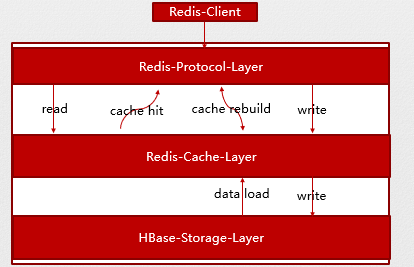
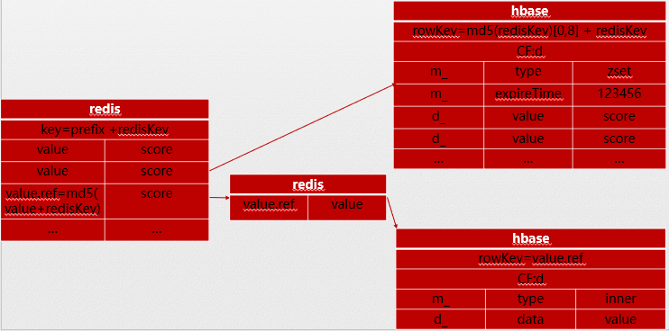

# camellia-redis-proxy-hbase
## 简介  
这是一个基于camellia-redis和camellia-hbase开发的camellia-redis-proxy的插件  
目前实现了zset相关的命令，可以实现自动的冷热数据分离（冷数据存hbase，热数据存redis）  
提供了一个spring-boot-starter，3行代码构建一个冷热分离的zset服务  

## 原理
对于zset数据结构，hbase存储完整的数据，redis仅作为缓存使用  
查询时，如果redis不存在，则会穿透到hbase捞数据，捞到之后会重建缓存    
考虑到zset的很多查询是增量的（如zrangeByScore），因此如果zset的value较大，则缓存中只会保留value的一个引用，以减少缓存的开销  
整体的数据结构图如下：  
1、冷热分层结构  
  
2、数据结构图  


## 注意事项
如果所有的业务数据均有ttl，则建议在hbase建表时加上ttl，此时要确保hbase表的ttl大于业务ttl（建议2倍以上）

## 使用场景
* 需要大容量redis，使用本插件可以节省内存成本  

## maven依赖
```
<dependency>
    <groupId>com.netease.nim</groupId>
    <artifactId>camellia-redis-proxy-hbase-spring-boot-starter</artifactId>
    <version>a.b.c</version>
</dependency>
```

## 支持的命令
```
##数据库
PING,AUTH,QUIT,EXISTS,DEL,TYPE,EXPIRE,
EXPIREAT,TTL,PERSIST,PEXPIRE,PEXPIREAT,PTTL
##有序集合
ZADD,ZINCRBY,ZRANK,ZCARD,ZSCORE,ZCOUNT,ZRANGE,ZRANGEBYSCORE,ZRANGEBYLEX,
ZREVRANK,ZREVRANGE,ZREVRANGEBYSCORE,ZREVRANGEBYLEX,ZREM,
ZREMRANGEBYRANK,ZREMRANGEBYSCORE,ZREMRANGEBYLEX,ZLEXCOUNT

```

## 示例  
### 配置示例（本地配置，详细配置可参考camellia-redis和camellia-hbase的README）
```
#以下是application.yml

server:
  port: 6381
spring:
  application:
    name: camellia-redis-proxy-server

#see CamelliaRedisProxyProperties
camellia-redis-proxy:
  password: pass123
  console-port: 16379

#see CamelliaHBaseProperties
camellia-hbase:
  type: local
  local:
    xml:
      xml-file: hbase.xml

#see CamelliaRedisProperties
camellia-redis:
  type: local
  local:
    resource: redis://abc@127.0.0.1:6379
```
```
#以下是redis-hbase.properties
#see com.netease.nim.camellia.redis.proxy.hbase.conf.RedisHBaseConfiguration

#hbase表名
hbase.table.name=nim:nim_camellia_redis_hbase

#redis缓存key前缀
redis.key.prefix=camellia

#zset的过期时间
zset.expire.seconds=259200
#zset的value超过多少触发value的二级缓存
zset.valueRef.threshold=48
#zset二级缓存过期时间
zset.valueRef.expire.seconds=86400

#null缓存的前缀
null.cache.prefix=camellia_null
#null缓存的过期时间
null.cache.expire.seconds=43200
not.null.cache.expire.seconds=60

#锁超时时间
redis.lock.expire.millis=2000

#是否开启监控
redis.hbase.monitor.enable=true
#监控数据刷新间隔（see RedisHBaseMonitor）
redis.hbase.monitor.interval.seconds=60

```

### 更多示例和源码
[hbase建表语句](/camellia-redis-proxy-hbase/doc/table.txt)  
[示例源码](/camellia-samples/camellia-redis-proxy-hbase-samples)
