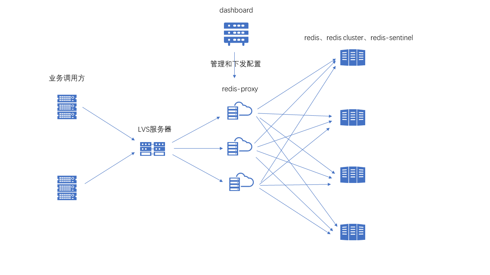
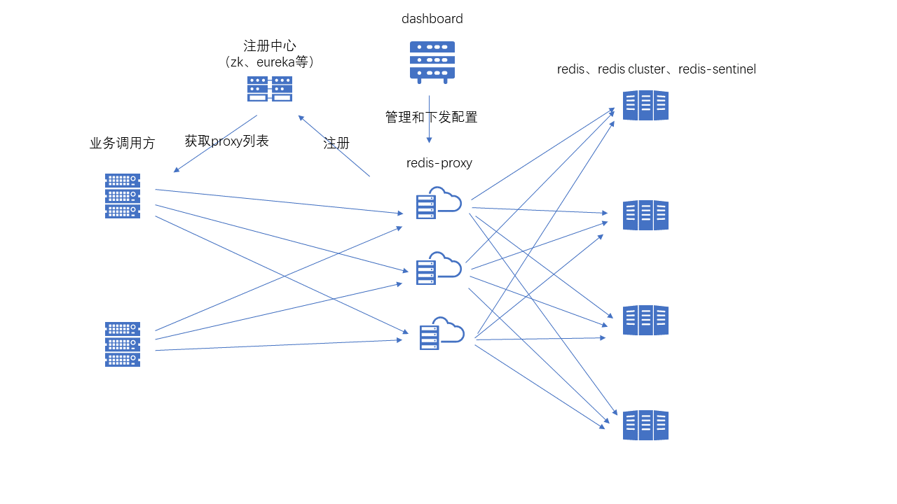

# camellia-redis-proxy
## 简介  
基于netty和camellia-core开发的redis代理服务，实现了redis协议，可以使用标准redis客户端连接      
区别：对于双（N）写场景，proxy会在配置的第一个双（N）写地址响应之后就返回（proxy会保证来自于同一个连接的命令的执行顺序在双写场景下是一致的）

## 特性
* 支持设置密码
* 支持代理到redis、redis sentinel、redis cluster  
* 支持配置自定义的分片逻辑（可以代理到多个redis/redis-sentinel/redis-cluster集群）  
* 支持配置自定义的双写逻辑（服务器会识别命令的读写属性，配置双写之后写命令会同时发往多个后端）  
* 支持外部插件，从而可以复用协议解析模块（当前包括camellia-redis-proxy-hbase插件，实现了zset命令的冷热分离存储）  
* 支持在线变更配置（需引入camellia-dashboard）  
* 支持多个业务逻辑共享一套proxy集群，如：A业务配置转发规则1，B业务配置转发规则2（需要在建立redis连接时通过client命令设置业务类型）      
* 支持自定义CommandInterceptor，拦截非法请求（如key/value不规范等）  
* 提供了一个spring-boot-starter，3行代码快速搭建camellia-redis-proxy集群  

## 使用场景
* 需要从redis迁移到redis cluster，但是客户端代码不方便修改  
* 客户端直连redis cluster，导致cluster服务器连接过多  
* 需要使用camellia-redis的多读多写和分片功能，但是客户端代码不方便修改  
* 想要对redis操作进行一定的控制（如命名规范性、key/value规范性等），可以使用proxy的CommandInterceptor进行自定义拦截  

## 监控
* 参见RedisMonitor，指标：客户端连接数、请求量、异常、请求耗时等  

## 部署架构
redis-proxy本身无状态，可以水平扩展，为了实现高可用和负载均衡，有如下两种部署方式：     
#### 部署方式一
可以通过前端添加四层代理（如LVS等）来统一访问入口，此时使用方式跟单节点redis没有区别    
  
#### 部署方式二
对于proxy侧，可以通过eureka、zk等注册中心进行注册，在客户端进行负载均衡   
如果要使用eureka作为注册中心，引入spring-cloud-starter-netflix-eureka-client即可  
如果要使用zk作为注册中心，引入camellia-redis-proxy-zk-registry-spring-boot-starter即可(参见camellia-redis-proxy-samples)    

对于客户端侧，如果是Java，则使用RedisProxyJedisPool代替JedisPool即可使用标准Jedis访问代理服务    
如果使用zk作为注册中心，使用ZkProxyDiscovery传入RedisProxyJedisPool即可  
    
特别的，如果客户端使用CamelliaRedisTemplate并且使用spring boot构建服务，此时的使用方式是：  
如果使用zk作为注册中心，则引入camellia-redis-spring-boot-starter和camellia-redis-zk-discovery-spring-boot-starter即可  
如果使用eureka作为注册中心，则引入camellia-redis-spring-boot-starter和camellia-redis-eureka-spring-boot-starter即可   
上述方式下，会自动初始化一个使用了camellia-redis-proxy的CamelliaRedisTemplate对象，业务可以使用Autowired的方式获取到该对象      
  

## maven依赖
```
<dependency>
  <groupId>com.netease.nim</groupId>
  <artifactId>camellia-redis-proxy-spring-boot-starter</artifactId>
  <version>a.b.c</version>
</dependency>
```

## 支持的命令
```
##数据库
PING,AUTH,ECHO,CLIENT,QUIT,EXISTS,DEL,TYPE,EXPIRE,
EXPIREAT,TTL,PERSIST,PEXPIRE,PEXPIREAT,PTTL,SORT
##字符串
SET,GET,GETSET,MGET,SETNX,SETEX,MSET,DECRBY,DECR,INCRBY,INCR,APPEND,
STRLEN,INCRBYFLOAT,PSETEX,SETRANGE,GETRANGE,SUBSTR,
##哈希表
HSET,HGET,HSETNX,HMSET,HMGET,HINCRBY,HEXISTS,HDEL,HLEN,HKEYS,
HVALS,HGETALL,HINCRBYFLOAT,HSCAN,
##队列
RPUSH,LPUSH,LLEN,LRANGE,LTRIM,LINDEX,LSET,LREM,LPOP,RPOP,LINSERT,LPUSHX,RPUSHX,
##集合
SADD,SMEMBERS,SREM,SPOP,SCARD,SISMEMBER,SRANDMEMBER,SSCAN,
##有序集合
ZADD,ZINCRBY,ZRANK,ZCARD,ZSCORE,ZCOUNT,ZRANGE,ZRANGEBYSCORE,ZRANGEBYLEX,
ZREVRANK,ZREVRANGE,ZREVRANGEBYSCORE,ZREVRANGEBYLEX,ZREM,
ZREMRANGEBYRANK,ZREMRANGEBYSCORE,ZREMRANGEBYLEX,ZLEXCOUNT,ZSCAN,
##位图
SETBIT,GETBIT,BITPOS,BITCOUNT,BITFIELD,
##地理位置
GEOADD,GEODIST,GEOHASH,GEOPOS,GEORADIUS,GEORADIUSBYMEMBER,
##脚本
EVAL,EVALSHA,

```

## 示例  
### 代理到redis cluster
```
server:
  port: 6380
spring:
  application:
    name: camellia-redis-proxy-server

camellia-redis-proxy:
  password: pass123
  monitor-enable: true
  monitor-interval-seconds: 30
  transpond:
    type: local
    local:
      type: simple
      resource: redis-cluster://@127.0.0.1:6379,127.0.0.1:6380,127.0.0.1:6381
```
### 复杂配置（包含读写分离和分片，单独的一个json文件）
```
server:
  port: 6380
spring:
  application:
    name: camellia-redis-proxy-server

camellia-redis-proxy:
  password: pass123
  transpond:
    type: local
    local:
      type: complex
      json-file: resource-table.json
```
```
{
  "type": "shading",
  "operation": {
    "operationMap": {
      "4": {
        "read": "redis://password1@127.0.0.1:6379",
        "type": "rw_separate",
        "write": {
          "resources": [
            "redis://password1@127.0.0.1:6379",
            "redis://password2@127.0.0.1:6380"
          ],
          "type": "multi"
        }
      },
      "0-2": "redis-cluster://@127.0.0.1:6379,127.0.0.1:6380,127.0.0.1:6381",
      "1-3-5": "redis://password2@127.0.0.1:6380"
    },
    "bucketSize": 6
  }
}
```
### 使用dashboard管理代理配置
```
server:
  port: 6380
spring:
  application:
    name: camellia-redis-proxy-server

camellia-redis-proxy:
  password: pass123
  transpond:
    type: remote
    remote:
      bid: 1
      bgroup: default
      dynamic: true
      url: http://127.0.0.1:8080
```
### 对于1.0.9及以上的版本，proxy提供了一个关于性能的参数，即转发模块使用哪种队列，默认不使用队列，可选的是LinkedBlockingQueue和Disruptor
```
默认不使用队列的选项下，性能比较中庸，而对于使用队列的参数下，会更耗CPU，如果机器配置较高可以选择，否则可能反而因为proxy层CPU消耗较高引起端侧RT上升，按需选择  
性能：Disruptor > LinkedBlockingQueue > None（不使用队列）   
CPU消耗：Disruptor > LinkedBlockingQueue > None（不使用队列）  
性能相关具体可见文末的[云主机环境测试（v1.0.8 vs v1.0.9）]   
``` 
使用LinkedBlockingQueue的配置示例：    
```
server:
  port: 6380
spring:
  application:
    name: camellia-redis-proxy-server

camellia-redis-proxy:
  password: pass123
  monitor-enable: true
  monitor-interval-seconds: 30
  transpond:
    type: local
    local:
      type: simple
      resource: redis-cluster://@127.0.0.1:6379,127.0.0.1:6380,127.0.0.1:6381
    redis-conf:
      queue-type: linkedblockingqueue
```
使用Disruptor的配置示例：    
```
server:
  port: 6380
spring:
  application:
    name: camellia-redis-proxy-server

camellia-redis-proxy:
  password: pass123
  monitor-enable: true
  monitor-interval-seconds: 30
  transpond:
    type: local
    local:
      type: simple
      resource: redis-cluster://@127.0.0.1:6379,127.0.0.1:6380,127.0.0.1:6381
    redis-conf:
      queue-type: disruptor
```

### 更多示例和源码
[示例源码](/camellia-samples/camellia-redis-proxy-samples)
  

## 性能测试
[代理到redis cluster（v1.0.4）](performance-report-1.md)  
[分片（v1.0.4）](performance-report-2.md)  
[双写（v1.0.4）](performance-report-3.md)  
[异常测试（v1.0.4）](performance-report-4.md)  
[云主机环境测试（v1.0.7）](performance-report-5.md)  
[云主机环境测试（v1.0.8 vs v1.0.9）](performance-report-6.md)    