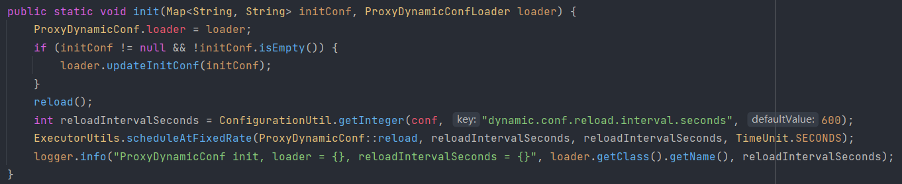

## 动态配置实现原理ProxyDynamicConf

### 初始化 init

当进行初始化的时候，首先会从`CamelliaServerProperties`中的conf读取配置，也就是yml文件配置中的`camellia-redis-proxy:config`键值对。之后`reload`进行第一次初始化，并且根据配置项`dynamic.conf.reload.interval.seconds`开启一个定时刷新配置的后台线程。

### 加载配置reload

CAS是因为调用reload的地方不止一个，所以同一时间只执行一次就行。当新旧文件不一致的时候，才会调用相应的`ProxyDynamicConfLoader`的load方法，比如本地配置文件加载器`FileBasedProxyDynamicConfLoader`。加载完配置文件之后，设置一下`ProxyDynamicConf.conf `，清除配置缓存，触发缓存清除回调函数。

回调函数大概是这些：

### 本地文件加载FileBasedProxyDynamicConfLoader

主要注意文件配置的优先级。

### Nacos文件加载 NacosProxyDynamicConfLoader

通过初始配置，也就是来自于yml文件的conf配置项，获取所有的key-value对并且通过`nacos.`前缀来进行筛选从而获得Nacos相关的配置。之后通过NacosFactory并且添加Nacos文件更新的监听器，达到只要文件更新就进行reload操作的效果。

配置解析方法，是通过key=value的形式，所以nacos里面用properties最好。