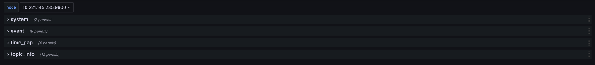
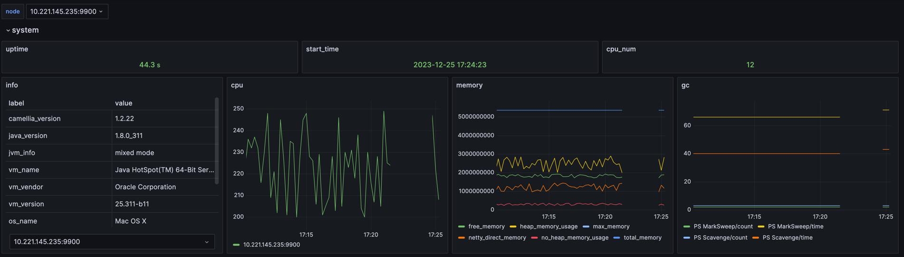
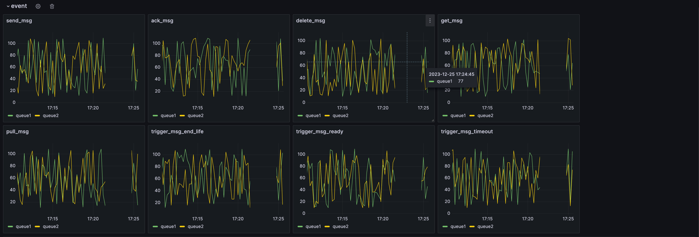

## use prometheus and grafana to monitor camellia-delay-queue

### step1 install prometheus

### step2 config prometheus
prometheus.yml
```yaml
# my global config
global:
  scrape_interval: 60s # Set the scrape interval to every 15 seconds. Default is every 1 minute.
  evaluation_interval: 60s # Evaluate rules every 15 seconds. The default is every 1 minute.
  # scrape_timeout is set to the global default (10s).

# Alertmanager configuration
alerting:
  alertmanagers:
    - static_configs:
        - targets:
          # - alertmanager:9093

# Load rules once and periodically evaluate them according to the global 'evaluation_interval'.
rule_files:
  # - "first_rules.yml"
  # - "second_rules.yml"

# A scrape configuration containing exactly one endpoint to scrape:
# Here it's Prometheus itself.
scrape_configs:
  # The job name is added as a label `job=<job_name>` to any timeseries scraped from this config.
  - job_name: "prometheus"

    # metrics_path defaults to '/metrics'
    # scheme defaults to 'http'.

    static_configs:
      - targets: ["localhost:9090"]
  # The job name is added as a label `job=<job_name>` to any timeseries scraped from this config.
  - job_name: "delay_queue_1"
    # metrics_path defaults to '/metrics'
    # scheme defaults to 'http'.
    metrics_path: "/metrics"
    static_configs:
      - targets: ["10.221.145.235:8080","10.221.145.234:8080"]%
```

config job_name, e.g. `delay_queue_1`  
config targets, e.g. `["10.221.145.235:8080","10.221.145.234:8080"]`  

`10.221.145.235/10.221.145.234` is delay queue ip, `8080` is delay queue port  

### step3 install grafana
add datasource prometheus

### step4 import grafana-config.json to grafana

[grafana-conf.json](grafana-conf.json)

you should:  
* replace `job` name in json, e.g. `test2` to `delay_queue_1`
* replace `prometheus.uid` in json, e.g. `ca547f68-c185-4008-9fe7-0ffa290eb12c`

### step5 dashboard

#### metrics
```
# HELP info Delay Queue Info
# TYPE info gauge
info{camellia_version="1.3.2",arch="x86_64",os_name="Mac OS X",os_version="10.16",system_load_average="4.025390625",vm_vendor="Oracle Corporation",vm_name="Java HotSpot(TM) 64-Bit Server VM",vm_version="25.311-b11",jvm_info="mixed mode",java_version="1.8.0_311",} 1
# HELP uptime Delay Queue Uptime
# TYPE uptime gauge
uptime 4723
# HELP start_time Delay Queue StartTime
# TYPE start_time gauge
start_time 1703496263296
# HELP memory_info Delay Queue Memory
# TYPE memory_info gauge
memory_info{type="free_memory"} 1830046763
memory_info{type="total_memory"} 5368709120
memory_info{type="max_memory"} 5368709120
memory_info{type="heap_memory_usage"} 2247304530
memory_info{type="no_heap_memory_usage"} 258527269
memory_info{type="netty_direct_memory"} 1168484143
# HELP cpu Delay Queue Cpu
# TYPE cpu gauge
cpu{type="cpu_num"} 12
cpu{type="usage"} 229
# HELP gc Delay Queue gc
# TYPE gc gauge
gc{name="PS Scavenge", type="count"} 3
gc{name="PS Scavenge", type="time"} 43
gc{name="PS MarkSweep", type="count"} 2
gc{name="PS MarkSweep", type="time"} 71
# HELP request Delay Queue Request
# TYPE request gauge
request{topic="queue1", type="sendMsg"} 38
request{topic="queue1", type="pullMsg"} 31
request{topic="queue1", type="deleteMsg"} 69
request{topic="queue1", type="ackMsg"} 37
request{topic="queue1", type="getMsg"} 18
request{topic="queue1", type="triggerMsgReady"} 49
request{topic="queue1", type="triggerMsgTimeout"} 13
request{topic="queue1", type="triggerMsgEndLife"} 107
request{topic="queue2", type="sendMsg"} 80
request{topic="queue2", type="pullMsg"} 104
request{topic="queue2", type="deleteMsg"} 82
request{topic="queue2", type="ackMsg"} 51
request{topic="queue2", type="getMsg"} 49
request{topic="queue2", type="triggerMsgReady"} 36
request{topic="queue2", type="triggerMsgTimeout"} 102
request{topic="queue2", type="triggerMsgEndLife"} 38
# HELP pull_msg_time_gap Delay Queue Pull Msg Time Gap
# TYPE pull_msg_time_gap gauge
pull_msg_time_gap{topic="queue1", type="count"} 47
pull_msg_time_gap{topic="queue1", type="avg"} 52.288458
pull_msg_time_gap{topic="queue1", type="max"} 385
pull_msg_time_gap{topic="queue2", type="count"} 19
pull_msg_time_gap{topic="queue2", type="avg"} 48.057658
pull_msg_time_gap{topic="queue2", type="max"} 665
# HELP ready_queue_time_gap Delay Queue Ready Queue Time Gap
# TYPE ready_queue_time_gap gauge
ready_queue_time_gap{topic="queue1", type="count"} 42
ready_queue_time_gap{topic="queue1", type="avg"} 10.714888
ready_queue_time_gap{topic="queue1", type="max"} 401
ready_queue_time_gap{topic="queue2", type="count"} 54
ready_queue_time_gap{topic="queue2", type="avg"} 49.430709
ready_queue_time_gap{topic="queue2", type="max"} 1125
# HELP topic_info Delay Queue Topic Info
# TYPE topic_info gauge
topic_info{topic="queue1", type="readyQueueSize"} 1
topic_info{topic="queue1", type="ackQueueSize"} 8
topic_info{topic="queue1", type="waitingQueueSize"} 5
topic_info{topic="queue1", type="size_0_1min"} 1
topic_info{topic="queue1", type="size_1min_10min"} 5
topic_info{topic="queue1", type="size_10min_30min"} 4
topic_info{topic="queue1", type="size_30min_1hour"} 2
topic_info{topic="queue1", type="size_1hour_6hour"} 8
topic_info{topic="queue1", type="size_6hour_1day"} 0
topic_info{topic="queue1", type="size_1day_7day"} 5
topic_info{topic="queue1", type="size_7day_30day"} 5
topic_info{topic="queue1", type="size_30day_infinite"} 1
topic_info{topic="queue2", type="readyQueueSize"} 6
topic_info{topic="queue2", type="ackQueueSize"} 0
topic_info{topic="queue2", type="waitingQueueSize"} 3
topic_info{topic="queue2", type="size_0_1min"} 8
topic_info{topic="queue2", type="size_1min_10min"} 9
topic_info{topic="queue2", type="size_10min_30min"} 3
topic_info{topic="queue2", type="size_30min_1hour"} 6
topic_info{topic="queue2", type="size_1hour_6hour"} 5
topic_info{topic="queue2", type="size_6hour_1day"} 9
topic_info{topic="queue2", type="size_1day_7day"} 2
topic_info{topic="queue2", type="size_7day_30day"} 7
topic_info{topic="queue2", type="size_30day_infinite"} 6
```

#### category  



####  system 



#### event



#### time_gap


#### topic_info


