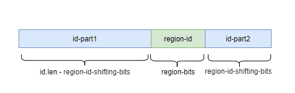

## 趋势递增的id生成算法（基于数据库）  
### 特性
* 单节点递增，全局趋势递增，保证全局唯一
* 支持根据tag维护多条序列，彼此独立
* 支持设置region标记（比特位数可以自定义），从而可以在单元化部署中保证不同单元之间id不冲突
* 基于数据库保证id唯一，基于内存保证分配速度，基于预留buffer确保rt稳定
* 当部署多单元的发号器，并使用region标记区分时，支持多单元id同步，从而避免不同单元间的id差距过大
* 提供了一个spring-boot-starter，快速搭建一个基于数据库的发号器集群

### 原理
* 数据库表记录每个tag当前分配到的id，每个发号器节点每次从数据库取一段id保留在内存中作为buffer提升性能
* 内存buffer快用完时，提前从数据库load一批新id，避免内存buffer耗尽时引起rt周期性上升
* 如果设置region标记，则regionId会作为id的后几位，确保不同单元间的id整体是保持相同的趋势递增规律的，为了避免id的最后几位是固定的，regionId会左移若干位
* 核心源码参见CamelliaSegmentIdGen

### id构成（二进制，设置了regionId且设置了regionId左移的情况下）


### 快速部署一（使用安装包部署独立服务）
具体见：[quick-start-package](quick-start-package-segment.md)

### 快速部署二（使用spring-boot-starter部署独立服务）
具体见：[quick-start-spring-boot](quick-start-spring-boot-starter-segment.md)

### 数据库
数据库建表语句：
```sql
CREATE TABLE `camellia_id_info` (
  `tag` varchar(512) NOT NULL COMMENT 'tag',
  `id` bigint(20) DEFAULT NULL COMMENT 'id',
  `createTime` bigint(20) DEFAULT NULL COMMENT '创建时间',
  `updateTime` bigint(20) DEFAULT NULL COMMENT '更新时间',
  PRIMARY KEY (`tag`)
) ENGINE=InnoDB DEFAULT CHARSET=utf8mb4 COMMENT='id生成表';
```

### api接口

#### 返回一个id（GET请求）  
http://127.0.0.1:8083/camellia/id/gen/segment/genId?tag=a  
返回示例：  
```json
{
  "code": 200,
  "data": 5071,
  "msg": "success"
}
```
#### 返回多个id（GET请求）  
http://127.0.0.1:8083/camellia/id/gen/segment/genIds?tag=a&count=3   
返回示例：  
```json
{
    "code": 200,
    "data": [
      5072,
      5073,
      5074
    ],
    "msg": "success"
}
```

#### 更新id起始值（POST请求）  
```
curl -d "tag=a&id=100" http://127.0.0.1:8083/camellia/id/gen/segment/update
```

#### 解析regionId（GET请求）  
http://127.0.0.1:8083/camellia/id/gen/segment/decodeRegionId?id=11111  
返回示例：
```json
{
    "code": 200,
    "data": 10,
    "msg": "success"
}
```

### 使用java-sdk访问api接口

当部署了独立的发号器服务后，为了方便使用http方法访问相关接口，我们提供了一个封装sdk（sdk支持缓存id用于提高性能）  

先引入maven依赖：  
```
<dependency>
    <groupId>com.netease.nim</groupId>
    <artifactId>camellia-id-gen-sdk</artifactId>
    <version>1.3.1</version>
</dependency>
```


示例代码如下：  
```java
public class CamelliaSegmentIdGenSdkTest {
    public static void main(String[] args) {
        CamelliaIdGenSdkConfig config = new CamelliaIdGenSdkConfig();
        config.setUrl("http://127.0.0.1:8083");
        config.setMaxRetry(5);//重试次数
        config.getSegmentIdGenSdkConfig().setCacheEnable(true);//表示sdk是否缓存id
        config.getSegmentIdGenSdkConfig().setStep(200);//sdk缓存的id数
        CamelliaSegmentIdGenSdk idGenSdk = new CamelliaSegmentIdGenSdk(config);

        System.out.println(idGenSdk.genId("a"));
        System.out.println(idGenSdk.genIds("a", 3));

        long target = 10*10000;
        int i = 0;
        long start = System.currentTimeMillis();
        while (true) {
            idGenSdk.genId("a");
            i++;
            if (i % 1000 == 0) {
                System.out.println("i=" + i);
            }
            if (i >= target) break;
        }
        long end = System.currentTimeMillis();
        System.out.println("QPS=" + (target / ((end - start)/1000.0)));
        //###idea里直接运行的简单测试结果：
        //开启sdk缓存并设置缓存step=200：
        //QPS=17286.084701815038
        //开启sdk缓存并设置缓存step=100：
        //QPS=8647.526807333103
        //不开启sdk缓存
        //QPS=4657.878801993572
    }
}

```

### 多单元id同步
当部署了多个单元的时候，每个单元都有一组发号器集群，通过regionId来区分不同的单元，对于同一个tag，不同单元的id消耗速度可能是不一样的  
随时时间的推移，不同单元的id的差距可能越来越大，如果不同单元间的数据需要双向同步，不同范围内的id插入同一个数据库表，可能导致性能问题  
camellia支持定时去同步不同单元间相同tag下的id的起始值，控制不同单元的id的间隔在可控范围内  

配置示例：
```yaml
camellia-id-gen-segment:
  region-bits: 4 #region比特位，0表示不区分单元
  region-id: 1 #regionId，如果regionBits为0，则regionId必须为0
  region-id-shifting-bits: 10 #regionId左移多少位
  tag-count: 1000 #服务包括的tag数量，会缓存在本地内存，如果实际tag数超过本配置，会导致本地内存被驱逐，进而丢失部分id段，丢失后会穿透到数据库）
  step: 1000 #每次从数据库获取一批id时的批次大小
  max-retry: 500 #当并发请求过来时，只会让一次请求穿透到db，其他请求会等待并重试，本配置表示重试的次数
  retry-interval-millis: 10 #当并发请求过来时，只会让一次请求穿透到db，其他请求会等待并重试，表示重试间隔
  id-sync-in-multi-regions-conf:
    enable: false #是否开启多单元id同步机制
    check-interval-seconds: 86400 #多久触发一次id同步
    id-update-threshold: 10000 #单元间id间隔超过多少触发同步操作，同步后id落后的单元的id起始值会增长到和id最大的单元的id起始值保持一致
    api-timeout-millis: 10000 #调用各单元api的超时时间，单位ms
    multi-region-urls:
      - http://127.0.0.1:8083 #单元一
      - http://127.0.0.1:8084 #单元二
#    white-list-tags: #哪些tag需要同步id，默认所有tag都需要同步
#      - test1
#      - test2
#    black-list-tags: #哪些tag不需要同步id
#      - test3
#      - test4
```

如果希望手动触发一次同步，可以调用接口（GET）：  
http://127.0.0.1:8083/camellia/id/gen/segment/sync  
返回示例：  
```json
{
    "code": 200,
    "data": true,
    "msg": "success"
}
```


### 如果你不想部署独立服务
则可以直接本地发号，具体见：[quick-start-java](quick-start-java-segment.md)