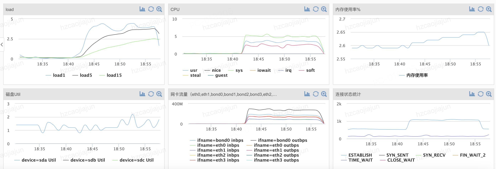
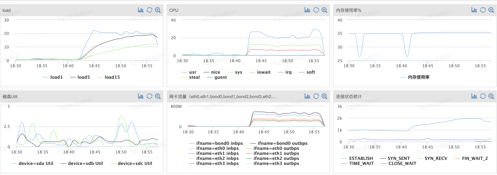
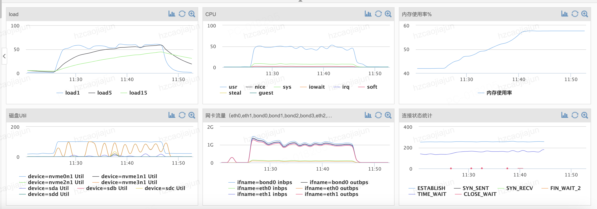
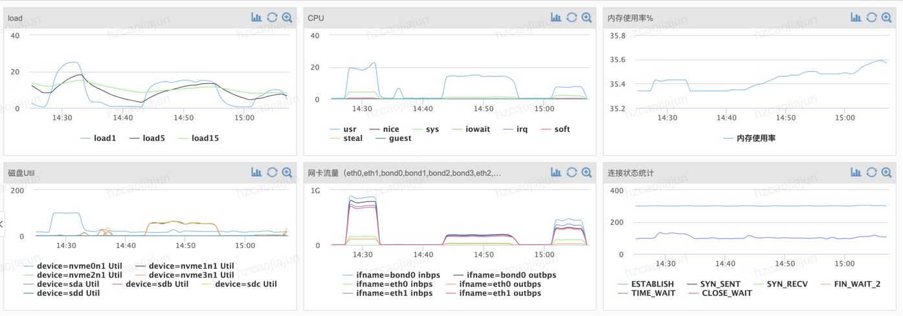
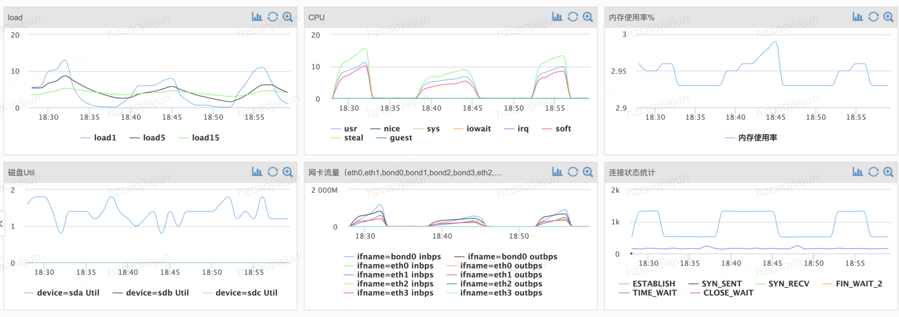
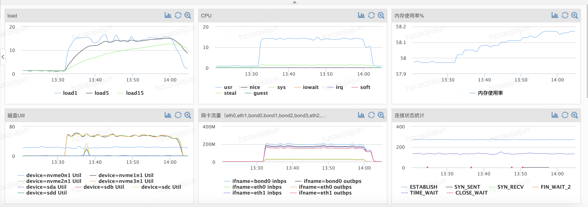
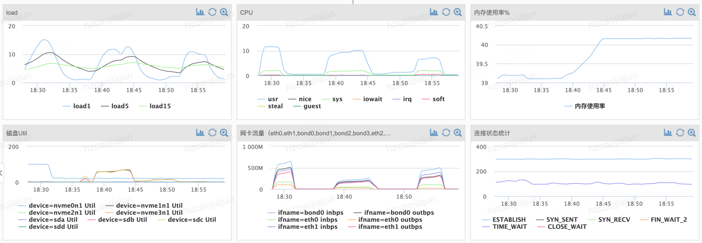
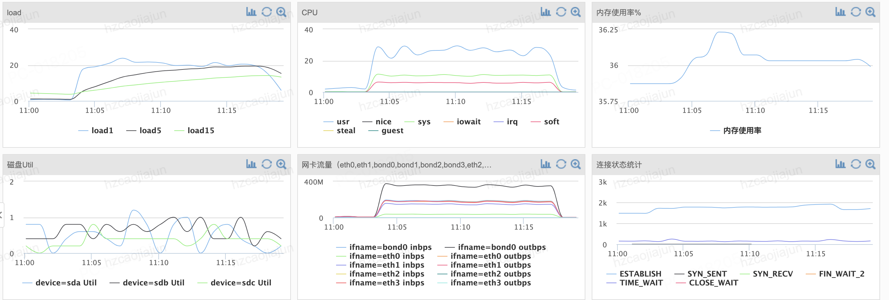
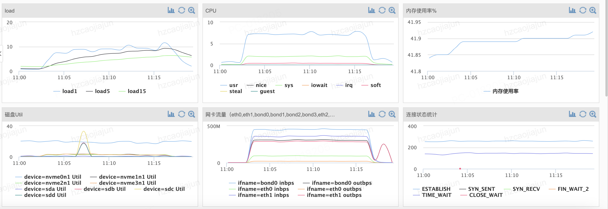

## 性能测试

|          集群          |                                        配置                                         | 数量 |
|:--------------------:|:---------------------------------------------------------------------------------:|---:|
|         压测机          |                       cpu：Intel(R)Xeon(R)E5-2670v3@2.30GHz                        |  1 |
| camellia-redis-proxy |                       cpu：Intel(R)Xeon(R)E5-2670v3@2.30GHz                        |  2 |
|         kv后端         | cpu: Intel(R)Xeon(R)Gold5220R@2.20GHz <br> 磁盘：3*intel p4510 nvme-ssd <br> 内存：512G |  3 |

## 版本

|          集群          |    版本    |                                       说明 |
|:--------------------:|:--------:|-----------------------------------------:|
|  memtier_benchmark   |  2.1.1   |                                          |
| camellia-redis-proxy |  1.3.0   |                        组成redis-cluster集群 |
|         obkv         | 4.2.1bp9 |               租户unit <br>  cpu72核/内存288G |
|         tikv         |  7.5.2   | max-thread-count 32 <br> block-cache 60G |
|        hbase         |  2.4.18  |           单台region-server配置了260g的堆内+堆外内存 |

## 压测程序

```
##obkv
/usr/bin/memtier_benchmark -s 10.44.40.23 -p 6380 -a fbe086bdd54d --cluster-mode -t 5 -c 50 -n 1000000 --pipeline=1 --distinct-client-seed --random-data --data-size=512 --key-prefix=str --key-maximum=10485760 --key-minimum=1 --command='set __key__ __value__' --command-key-pattern=G

##tikv
/usr/bin/memtier_benchmark -s 10.44.40.23 -p 5380 -a 648d04f8c3f9 --cluster-mode -t 5 -c 50 -n 1000000 --pipeline=1 --distinct-client-seed --random-data --data-size=512 --key-prefix=str --key-maximum=10485760 --key-minimum=1 --command='set __key__ __value__' --command-key-pattern=G

##hbase
/usr/bin/memtier_benchmark -s 10.44.40.23 -p 4380 -a ab39725fb75f --cluster-mode -t 5 -c 50 -n 1000000 --pipeline=1 --distinct-client-seed --random-data --data-size=512 --key-prefix=str --key-maximum=10485760 --key-minimum=1 --command='set __key__ __value__' --command-key-pattern=G

```

* 5*50个客户端连接，每个连接发100w个set请求，累计2.5亿个set请求
* key的数量为1000w，value的大小为512字节的随机字符
* 也就是每个key大约会重复执行25次set请求

## 压测结果

|  后端   |    qps    |  rt-avg |   rt-p99 |  rt-p999 |   KB/sec | cpu(proxy) | cpu(kv) |
|:-----:|:---------:|--------:|---------:|---------:|---------:|-----------:|--------:|
| obkv  | 290218.55 | 1.72102 |  8.06300 | 13.69500 | 28335.46 |        36% |     53% |
| tikv  | 136799.62 | 3.53078 | 14.78300 | 22.01500 | 13356.42 |        33% |     15% |
| hbase | 287964.87 | 1.72181 |  7.35900 | 14.59100 | 28115.43 |        40% |     10% |


## 压测数据明细

### obkv

#### memtier_benchmark
```
hzcaojiajun@nim-test-db3:~$ /usr/bin/memtier_benchmark -s 10.44.40.23 -p 6380 -a fbe086bdd54d --cluster-mode -t 5 -c 50 -n 1000000 --pipeline=1 --distinct-client-seed --random-data --data-size=512 --key-prefix=str --key-maximum=10485760 --key-minimum=1 --command='set __key__ __value__' --command-key-pattern=G
Writing results to stdout
[RUN #1] Preparing benchmark client...
[RUN #1] Launching threads now...
[RUN #1 100%, 862 secs]  0 threads:   250000000 ops,  312906 (avg:  289952) ops/sec, 14.92MB/sec (avg: 13.82MB/sec),  1.07 (avg:  1.72) msec latency

5         Threads
50        Connections per thread
1000000   Requests per client


ALL STATS
============================================================================================================================
Type         Ops/sec    MOVED/sec      ASK/sec    Avg. Latency     p50 Latency     p99 Latency   p99.9 Latency       KB/sec
----------------------------------------------------------------------------------------------------------------------------
Sets       290218.55         0.00         0.00         1.72102         1.43900         8.06300        13.69500     14167.73
Totals     290218.55         0.00         0.00         1.72102         1.43900         8.06300        13.69500     28335.46

```

#### 压测客户端



#### proxy



#### kv后端




### tikv

#### memtier_benchmark

```
hzcaojiajun@nim-test-db3:~$ /usr/bin/memtier_benchmark -s 10.44.40.23 -p 5380 -a 648d04f8c3f9 --cluster-mode -t 5 -c 50 -n 1000000 --pipeline=1 --distinct-client-seed --random-data --data-size=512 --key-prefix=str --key-maximum=10485760 --key-minimum=1 --command='set __key__ __value__' --command-key-pattern=G
Writing results to stdout
[RUN #1] Preparing benchmark client...
[RUN #1] Launching threads now...
[RUN #1 100%, 1823 secs]  0 threads:   250000000 ops,  101465 (avg:  137130) ops/sec, 4.84MB/sec (avg: 6.54MB/sec),  2.46 (avg:  3.53) msec latency

5         Threads
50        Connections per thread
1000000   Requests per client


ALL STATS
============================================================================================================================
Type         Ops/sec    MOVED/sec      ASK/sec    Avg. Latency     p50 Latency     p99 Latency   p99.9 Latency       KB/sec
----------------------------------------------------------------------------------------------------------------------------
Sets       136799.62         0.00         0.00         3.53078         3.11900        14.78300        22.01500      6678.21
Totals     136799.62         0.00         0.00         3.53078         3.11900        14.78300        22.01500     13356.42

```

#### 压测客户端



#### proxy



#### kv后端



### hbase

#### memtier_benchmark

```
hzcaojiajun@nim-test-db3:~$ /usr/bin/memtier_benchmark -s 10.44.40.23 -p 4380 -a ab39725fb75f --cluster-mode -t 5 -c 50 -n 1000000 --pipeline=1 --distinct-client-seed --random-data --data-size=512 --key-prefix=str --key-maximum=10485760 --key-minimum=1 --command='set __key__ __value__' --command-key-pattern=G
Writing results to stdout
[RUN #1] Preparing benchmark client...
[RUN #1] Launching threads now...
[RUN #1 100%, 868 secs]  0 threads:   250000000 ops,  187757 (avg:  287869) ops/sec, 8.95MB/sec (avg: 13.72MB/sec),  1.33 (avg:  1.72) msec latency

5         Threads
50        Connections per thread
1000000   Requests per client


ALL STATS
============================================================================================================================
Type         Ops/sec    MOVED/sec      ASK/sec    Avg. Latency     p50 Latency     p99 Latency   p99.9 Latency       KB/sec
----------------------------------------------------------------------------------------------------------------------------
Sets       287964.87         0.00         0.00         1.72181         1.45500         7.35900        14.59100     14057.71
Totals     287964.87         0.00         0.00         1.72181         1.45500         7.35900        14.59100     28115.43

```


#### 压测客户端



#### proxy



#### kv后端




## camellia-redis-proxy关键配置

```properties
kv.hash.encode.version=1
kv.zset.encode.version=0
kv.set.encode.version=1

kv.key.meta.local.cache.enable=true
kv.hash.local.cache.enable=true
kv.zset.local.cache.enable=true
kv.set.local.cache.enable=true

kv.key.meta.lru.cache.capacity=6000000
kv.hash.lru.cache.capacity=2000000
kv.zset.lru.cache.capacity=2000000
kv.zset.index.lru.cache.capacity=2000000
kv.set.lru.cache.capacity=2000000

kv.write.buffer.key.meta.enable=true
kv.write.buffer.hash.enable=true
kv.write.buffer.zset.enable=true
kv.write.buffer.set.enable=true

kv.write.buffer.key.meta.max.size=100000
kv.write.buffer.hash.max.size=100000
kv.write.buffer.zset.max.size=100000
kv.write.buffer.set.max.size=100000
```

启动参数：

```
-Xms32768m, -Xmx32768m -XX:+UseZGC -XX:+ZGenerational -Dio.netty.tryReflectionSetAccessible=true --add-opens java.base/java.lang.reflect=ALL-UNNAMED --add-opens=java.base/java.lang=ALL-UNNAMED --add-opens=java.base/java.io=ALL-UNNAMED --add-opens=java.base/java.math=ALL-UNNAMED --add-opens=java.base/java.net=ALL-UNNAMED --add-opens=java.base/java.nio=ALL-UNNAMED --add-opens=java.base/java.security=ALL-UNNAMED --add-opens=java.base/java.text=ALL-UNNAMED --add-opens=java.base/java.time=ALL-UNNAMED --add-opens=java.base/java.util=ALL-UNNAMED --add-opens=java.base/jdk.internal.access=ALL-UNNAMED --add-opens=java.base/jdk.internal.misc=ALL-UNNAMED --add-opens=java.rmi/sun.rmi.transport=ALL-UNNAMED --add-exports=java.base/sun.nio.ch=ALL-UNNAMED --add-exports=jdk.unsupported/sun.misc=ALL-UNNAMED --add-opens=jdk.compiler/com.sun.tools.javac.processing=ALL-UNNAMED -Xlog:async -Xlog:gc*=info:file=/home/popo/logs/proxy_gc.log:time,uptime,level,tags,tid:filesize=512M,filecount=2
```

java版本：`21.0.1`


## 建表语句

### obkv

```
CREATE TABLE `camellia_kv` (
    `slot` int(9) NOT NULL,
    `k` varbinary(1024) NOT NULL,
    `v` varbinary(1024) NOT NULL
    PRIMARY KEY (`slot`, `k`))
PARTITION BY KEY(slot) PARTITIONS 97;

```

#### hbase

```
create 'camellia_kv',{NAME => 'd', VERSIONS => '1',COMPRESSION=>'SNAPPY'},{ NUMREGIONS => 20 , SPLITALGO => 'UniformSplit'}
```

