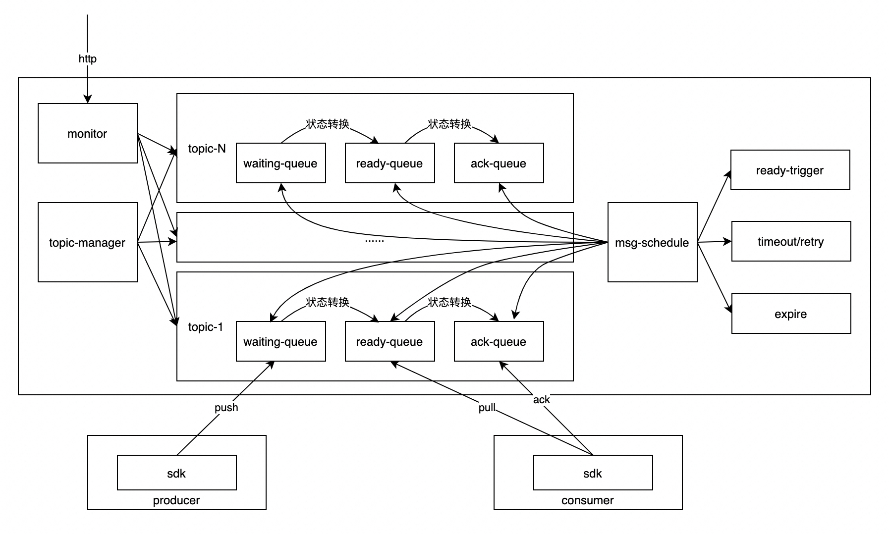

# camellia-delay-queue
## 介绍
基于redis实现的一款延迟队列服务

## 特性
* 基于redis实现，底层使用CamelliaRedisTemplate，支持redis-standalone、redis-sentinel、redis-cluster
* 对外以http接口方式暴露服务，语言无关，对于消费端当前基于pull模型（支持长轮询，也支持短轮询），未来会提供push模型
* 提供了camellia-delay-queue-server-spring-boot-starter，快速部署delay-queue-server集群
* 支持节点水平扩展，支持多topic
* 提供丰富的监控数据
* 提供了一个java-sdk，也提供了camellia-delay-queue-sdk-spring-boot-starter，方便快速接入
* 注意事项：1.0.61版本开始支持长轮询，且java-sdk默认使用长轮询，如果有升级，请注意升级顺序（需要先升级server，再升级sdk）

## 服务架构


## 架构说明
### 名词解释
* topic，delay-queue-server通过topic来区分不同的延迟队列
* namespace，每个delay-queue-server都会有一个命名空间，不同的server可以通过不同的redis地址来隔离，也可以通过不同的namespace来隔离
* msg，提交给delay-queue-server的消息，是一个字符串，不建议太长，避免占用过多的redis内存资源
* msgId，用于标识一条消息（topic内唯一），可以发送消息时指定，也可以不指定由服务器生成，当客户端指定时，相同msgId的消息重复发送会被去重（只有第一次能成功），此外，你可以基于这个msgId去进行查询和删除msg
* delayMillis，消息的延迟时间，单位ms，表示提交msg之后多久可以被消费
* ttlMillis，表示消息的过期时间，指的是消息状态转变为可消费后，多久之内如果未被成功消费，则会被删除
* maxRetry，表示消费时的最大重试次数，最多消费次数是maxRetry+1，ttlMillis和maxRetry任一一个满足，消息将不再被投递给消费者

### 原理解析
* 基本原理基于redis+定时器实现
* 服务器主要包括五个数据结构    

|数据结构|类型|redis结构说明|功能|
|:---:|:---:|:---:|:---:|
|waitingQueue|ZSET|key=前缀+namespace+topic<br>value=msgId<br>score=消息触发时间戳（如果是延迟10s，则为服务器收到消息时的当前时间戳+10s）|服务器会启动定时器定时扫描score大于当前时间戳的msgId，移动到readyQueue|
|readyQueue|LIST|key=前缀+namespace+topic<br>value=msgId<br>先进先出|当客户端来pullMsg时，会检查readyQueue中是否有待消费的消息，如果有，则把msgId从readyQueue移动到ackQueue|
|ackQueue|ZSET|key=前缀+namespace+topic<br>value=msgId<br>score=消息消费的超时时间（如果超时时间是30s，则为消息被pull时的服务器当前时间戳+30s）|当消息被pull后，msgId位于ackQueue中，服务器会启动定时器扫描消费超时的消息，移动回readyQueue中重试，如果已经超过最大重试次数，则直接删除|
|topicQueue|ZSET|key=前缀+namespace<br>value是topic<br>score=topic最近一次操作时间|所有的定时器的根节点来自于本队列中维护的topic，此外会检测非活跃的topic，并进行资源回收|
|msg|STRING|key=前缀+namespace+topic+msgId<br>value=msg|其他数据结构只记录msgId，此外，当消息被消费成功了或者过期了，消息不会立即删除，而是会再保存一小段时间用于一些查询请求|

* 服务器会启动多个扫描线程，扫描topic和消息的状态，当部署多节点时，各个节点会使用分布式锁来避免并发操作，同时也能提高效率
* 多个数据结构之间的状态转换，使用了redis的lua脚本来保证原子性
* 通过redis的pubsub通道来实现长轮询的通知通道
* 对外暴露的核心接口包括：sendMsg、longPollingMsg、pullMsg、ackMsg、getMsg、deleteMsg
* 此外还提供了getMonitorData、getTopicInfo、getTopicInfoList这样的监控接口用于暴露数据


## 快速开始

### 搭建delay-queue-server
建立一个spring-boot工程，引入maven依赖
```
<dependency>
    <groupId>com.netease.nim</groupId>
    <artifactId>camellia-delay-queue-server-spring-boot-starter</artifactId>
    <version>1.2.21</version>
</dependency>
```
编写main方法
```java
@SpringBootApplication
@ComponentScan(basePackages = {"com.netease.nim.camellia.delayqueue.server"})
public class Application {

    public static void main(String[] args) {
        SpringApplication.run(Application.class, args);
    }
}
```
增加application.yml文件，主要是设置redis地址
```yaml

server:
  port: 8080
spring:
  application:
    name: camellia-delay-queue-server

camellia-delay-queue-server:
  ttl-millis: 3600000 #消息延迟时间到达转为可消费状态后，多久没有被成功消费后被删除，默认1h，提交消息时可以对每条消息都设置，如果不设置则走这个默认值
  max-retry: 10 #消息延迟时间到达转为可消费状态后，最多被消费几次后还未成功ack后，也会标记为删除，默认10次，提交消息时可以对每条消息都设置，如果不设置则走这个默认值
  ack-timeout-millis: 30000 #每次消息被消费后的ack超时时间，消费者来拉取时可以设置，如果没有设置，则使用本默认值
#  monitorIntervalSeconds: 60 #监控数据刷新周期，默认60s
#  namespace: default #命名空间，默认default
#  schedule-thread-num: 4 #定时器的线程池大小，默认是cpu数，一般不需要特殊配置
#  msg-schedule-millis: 100 #定时器的轮询间隔，代表了延迟消息的时间精确度，默认100ms，一般不需要特殊配置
#  topic-schedule-seconds: 600 #扫描topic是否活跃的间隔，默认600s，一般不需要特殊配置
#  check-trigger-thread-num: 32 #扫描消息是否可消费的线程池大小，默认是cpu数*4，一般不需要特殊配置
#  check-timeout-thread-num: 32 #扫描消息是否消息超时的线程池大小，默认是cpu数*4，一般不需要特殊配置
#  end-life-msg-expire-millis: 3000000 #消息到达终态（成功消息or过期or重试次数超限等），消息继续保留用于查询的缓存时间，默认5分钟
#  topic-active-tag-timeout-millis: 1800000 #一个topic多久不活跃（没有待消费的消息，也没有针对该topic的增删改查操作）会被回收相关资源，默认30分钟


camellia-redis:
  type: local
  local:
    resource: redis://@127.0.0.1:6379  #redis-standalone
  #    resource: redis://passwd@127.0.0.1:6379  #redis-standalone with password
  #    resource: redis-cluster://@127.0.0.1:6379,127.0.0.1:6380,127.0.0.1:6381 #redis-cluster
  #    resource: redis-cluster://passwd@127.0.0.1:6379,127.0.0.1:6380,127.0.0.1:6381 #redis-cluster with password
  #    resource: redis-sentinel://@127.0.0.1:6379,127.0.0.1:6380,127.0.0.1:6381/masterName  #redis-sentinel
  #    resource: redis-sentinel://passwd@127.0.0.1:16379,127.0.0.1:16380,127.0.0.1:16381/masterName  #redis-sentinel with password
  redis-conf:
    jedis:
      timeout: 2000
      min-idle: 0
      max-idle: 32
      max-active: 32
      max-wait-millis: 2000
    jedis-cluster:
      max-wait-millis: 2000
      min-idle: 0
      max-idle: 8
      max-active: 16
      max-attempts: 5
      timeout: 2000

```
随后，启动即可  

### 使用按照包启动delay-queue服务器
使用安装包快速启动delay-queue-server，具体见：[quick-start-package](quick-start-package.md)

### 如果要使用java21/spring-boot3/docker，请参考：[camellia-jdk21-bootstraps](https://github.com/caojiajun/camellia-jdk21-bootstraps)

### producer示例
建立一个spring-boot工程，引入maven依赖：  
```
<dependency>
    <groupId>com.netease.nim</groupId>
    <artifactId>camellia-delay-queue-sdk-spring-boot-starter</artifactId>
    <version>1.2.21</version>
</dependency>
<dependency>
    <groupId>org.springframework.boot</groupId>
    <artifactId>spring-boot-starter-web</artifactId>
</dependency>
```
增加application.yml文件，主要是配置delay-queue-server的地址（可以基于nginx配置一个域名，也可以基于注册中心）
```yaml
server:
  port: 8081
spring:
  application:
    name: camellia-delay-queue-producer


camellia-delay-queue-sdk:
  url: http://127.0.0.1:8080
  listener-config:
    ack-timeout-millis: 30000 #消费时告知服务器的消费ack超时时间，默认30s，添加listener时可以单独设置，如果未设置，则走本默认配置
    pull-batch: 1 #每次pullMsg时的批量大小，默认1，添加listener时可以单独设置，如果未设置，则走本默认配置，需要特别注意pull-batch和ack-timeout-millis的关系，避免未及时ack被服务器判断超时导致重复消费
    pull-interval-time-millis: 100 #pullMsg的轮询间隔，默认100ms，添加listener时可以单独设置，如果未设置，则走本默认配置
    pull-threads: 1 #每个listener的默认pullMsg线程数量，默认1，添加listener时可以单独设置，如果未设置，则走本默认配置
    consume-threads: 1 #每个listener的消息消费线程数量，默认1，添加listener时可以单独设置，如果未设置，则走本默认配置
  http-config:
    connect-timeout-millis: 5000 #到server的http超时配置，默认5000，一般不需要特殊配置
    read-timeout-millis: 5000 #到server的http超时配置，默认5000，一般不需要特殊配置
    write-timeout-millis: 500 #到server的http超时配置，默认5000，一般不需要特殊配置
    max-requests: 4096 #到server的http配置，一般不需要特殊配置
    max-requests-per-host: 1024 #到server的http配置，一般不需要特殊配置
    max-idle-connections: 1024 #到server的http配置，一般不需要特殊配置
    keep-alive-seconds: 30 #到server的http配置，一般不需要特殊配置
```
编写生产入口代码，spring会自动注入CamelliaDelayQueueSdk  
```java
@RestController
public class ProducerController {

    private static final Logger logger = LoggerFactory.getLogger(ProducerController.class);

    @Autowired
    private CamelliaDelayQueueSdk delayQueueSdk;

    @RequestMapping("/sendDelayMsg")
    public CamelliaDelayMsg sendDelayMsg(@RequestParam("topic") String topic,
                                         @RequestParam("msg") String msg,
                                         @RequestParam("delaySeconds") long delaySeconds,
                                         @RequestParam(value = "ttlSeconds", required = false, defaultValue = "30") long ttlSeconds,
                                         @RequestParam(value = "maxRetry", required = false, defaultValue = "3") int maxRetry) {
        logger.info("sendDelayMsg, topic = {}, msg = {}, delaySeconds = {}, ttlSeconds = {}, maxRetry = {}", topic, msg, delaySeconds, ttlSeconds, maxRetry);
        return delayQueueSdk.sendMsg(topic, msg, delaySeconds, TimeUnit.SECONDS, ttlSeconds, TimeUnit.SECONDS, maxRetry);
    }
}
```
增加主类，启动即可

### consumer示例
建立一个spring-boot工程，引入maven依赖：
```
<dependency>
    <groupId>com.netease.nim</groupId>
    <artifactId>camellia-delay-queue-sdk-spring-boot-starter</artifactId>
    <version>1.2.21</version>
</dependency>
```
增加application.yml文件，主要是配置delay-queue-server的地址（可以基于nginx配置一个域名，也可以基于注册中心）
```yaml
server:
  port: 8081
spring:
  application:
    name: camellia-delay-queue-consumer


camellia-delay-queue-sdk:
  url: http://127.0.0.1:8080
  listener-config:
    ack-timeout-millis: 30000 #消费时告知服务器的消费ack超时时间，默认30s，添加listener时可以单独设置，如果未设置，则走本默认配置
    pull-batch: 1 #每次pullMsg时的批量大小，默认1，添加listener时可以单独设置，如果未设置，则走本默认配置，需要特别注意pull-batch和ack-timeout-millis的关系，避免未及时ack被服务器判断超时导致重复消费
    pull-interval-time-millis: 100 #pullMsg的轮询间隔，默认100ms，添加listener时可以单独设置，如果未设置，则走本默认配置，短轮询时本配置生效
    pull-threads: 1 #每个listener的默认pullMsg线程数量，默认1，添加listener时可以单独设置，如果未设置，则走本默认配置
    consume-threads: 1 #每个listener的消息消费线程数量，默认1，添加listener时可以单独设置，如果未设置，则走本默认配置
    long-polling-enable: true #是否开启长轮询，默认true
    long-polling-timeout-millis: 10000 #长轮询的超时时间，默认10s
  http-config:
    connect-timeout-millis: 5000 #到server的http超时配置，默认5000，一般不需要特殊配置
    read-timeout-millis: 5000 #到server的http超时配置，默认5000，一般不需要特殊配置
    write-timeout-millis: 500 #到server的http超时配置，默认5000，一般不需要特殊配置
    max-requests: 4096 #到server的http配置，一般不需要特殊配置
    max-requests-per-host: 1024 #到server的http配置，一般不需要特殊配置
    max-idle-connections: 1024 #到server的http配置，一般不需要特殊配置
    keep-alive-seconds: 30 #到server的http配置，一般不需要特殊配置
```
编写CamelliaDelayMsgListener：
```java
/**
 * 使用spring托管
 * 此时需要service实现CamelliaDelayMsgListener接口，并且添加@CamelliaDelayMsgListenerConfig注解设置topic以及其他参数
 * Created by caojiajun on 2022/7/21
 */
@Component
@CamelliaDelayMsgListenerConfig(topic = "topic1", pullThreads = 1, consumeThreads = 3)
public class ConsumerService1 implements CamelliaDelayMsgListener {

    private static final Logger logger = LoggerFactory.getLogger(ConsumerService1.class);

    @Override
    public boolean onMsg(CamelliaDelayMsg delayMsg) {
        try {
            logger.info("onMsg, time-gap = {}, delayMsg = {}", System.currentTimeMillis() - delayMsg.getTriggerTime(), JSONObject.toJSONString(delayMsg));
            return true;
        } catch (Exception e) {
            logger.error(e.getMessage(), e);
            return false;//返回false，则delay-queue-server会重试
        }
    }
}
```
编写主类，启动即可，则consumer会消费对应的topic的消息  

上述示例代码参见：（see [sample-code](/camellia-samples/camellia-delay-queue-samples)）  
直接依次启动server、producer、consumer即可，随后你可以通过producer往delay-queue-server发送一条延迟消息：
```
#表示给topic1发送了一条消息，内容是abc，延迟10s执行
curl 'http://127.0.0.1:8081/sendDelayMsg?topic=topic1&msg=abc&delaySeconds=10'
```
随后，你可以观察delay-queue-server和consumer的日志

对于producer和consumer，除了引入spring-boot-starter，也可以引入裸的sdk包，自己去new一个CamelliaDelayQueueSdk实例，随后进行消息的发送和消费监听：  
```
<dependency>
    <groupId>com.netease.nim</groupId>
    <artifactId>camellia-delay-queue-sdk</artifactId>
    <version>1.2.21</version>
</dependency>
```
示例代码：  
```java
public class TestMain {

    private static final Logger logger = LoggerFactory.getLogger(ConsumerService1.class);

    public static void main(String[] args) {
        CamelliaDelayQueueSdkConfig config = new CamelliaDelayQueueSdkConfig();
        config.setUrl("http://127.0.0.1:8080");
        CamelliaDelayQueueSdk sdk = new CamelliaDelayQueueSdk(config);
        
        //发送消息
        sdk.sendMsg("topic1", "abc", 10, TimeUnit.SECONDS);
        
        //消费消息
        sdk.addMsgListener("topic1", delayMsg -> {
            try {
                logger.info("onMsg, time-gap = {}, delayMsg = {}", 
                        System.currentTimeMillis() - delayMsg.getTriggerTime(), JSONObject.toJSONString(delayMsg));
                return true;
            } catch (Exception e) {
                logger.error(e.getMessage(), e);
                return false;
            }
        });
    }
}
```

## 一个简单的性能测试
* 台式机（cpu=i5-10500），使用idea直接跑（没有调启动参数），先启动camellia-delay-queue-server-samples，再启动PerformanceTest.java（源码见 [sample-code](/camellia-samples/camellia-delay-queue-samples)）  
* 100个topic，每个topic1000条消息，每个topic设置10个消费线程，每条消息延迟10s-70s不等（随机），10w条消息在41s内发送完毕  
* 消费端的延迟（实际消费时间和预期消费时间的GAP），平均43ms，最大798ms，可以看到没有delay不稳定的情况  

## 接口文档
对于java客户端，使用sdk基本满足了需求，如果是其他语言，可以基于delay-queue-server的服务器api自行封装sdk  
服务器接口文档如下：  

### 发送消息
POST /camellia/delayQueue/sendMsg HTTP/1.1  
Content-Type:application/x-www-form-urlencoded;charset=utf-8  

|参数|类型|是否必填|说明|
|:---:|:---:|:---:|:---:|
|topic|string|是|topic|
|msgId|string|否|消息id，topic内唯一，如果不填则由服务器生成；相同msgId的消息重复发送会被去重（只有第一次有效）|
|msg|string|是|消息内容|
|delayMillis|number|是|延迟时间，单位ms|
|ttlMillis|number|否|过期时间，单位ms，若不填或者小于等于0，则使用服务器默认配置|
|maxRetry|number|否|消费最大重试次数，若不填或者小于0，则使用服务器默认配置|

响应  
```json
{
  "code": 200,
  "msg": "success",
  "delayMsg":
  {
    "topic": "topic1",
    "msgId": "6faa7316bc504f97aa6dd03ae12a2170",
    "msg": "abc",
    "produceTime": 1658492212132,
    "triggerTime": 1658492222132,
    "expireTime": 1658492242132,
    "maxRetry": 3,
    "retry": 0,
    "status": 1
  }
}
```

### 删除消息
POST /camellia/delayQueue/deleteMsg HTTP/1.1  
Content-Type:application/x-www-form-urlencoded;charset=utf-8

|参数|类型|是否必填|说明|
|:---:|:---:|:---:|:---:|
|topic|string|是|topic|
|msgId|string|是|消息id|
|release|boolean|否|是否立即释放redis内存，默认false|

响应
```json
{
  "code": 200,
  "msg": "success"
}
```

### pull消息用于消费（短轮询接口，不管有没有消息立即返回）
POST /camellia/delayQueue/pullMsg HTTP/1.1  
Content-Type:application/x-www-form-urlencoded;charset=utf-8

|参数|类型|是否必填|说明|
|:---:|:---:|:---:|:---:|
|topic|string|是|topic|
|ackTimeoutMillis|number|否|拉到的消息，多久之内ack，如果超时未ack，服务器将重试，如果不填或者小于0则使用服务器默认配置|
|batch|number|否|最多拉多少条，如果不填或者小于0则使用服务器默认配置|

响应
```json
{
  "code": 200,
  "msg": "success",
  "delayMsgList":
  [
    {
      "topic": "topic1",
      "msgId": "6faa7316bc504f97aa6dd03ae12a2170",
      "msg": "abc",
      "produceTime": 1658492212132,
      "triggerTime": 1658492222132,
      "expireTime": 1658492242132,
      "maxRetry": 3,
      "retry": 0,
      "status": 1
    },
    {
      "topic": "topic1",
      "msgId": "6faa7316bc504f97aa6dd03ae12a2171",
      "msg": "def",
      "produceTime": 1658492212132,
      "triggerTime": 1658492222132,
      "expireTime": 1658492242132,
      "maxRetry": 3,
      "retry": 0,
      "status": 1
    }
  ]
}
```

### pull消息用于消费（长轮询接口，如果有消息立即返回，如果没有消息，会hold住连接直到longPollingTimeoutMillis）
POST /camellia/delayQueue/longPollingMsg HTTP/1.1  
Content-Type:application/x-www-form-urlencoded;charset=utf-8

|参数|类型|是否必填|说明|
|:---:|:---:|:---:|:---:|
|topic|string|是|topic|
|ackTimeoutMillis|number|否|拉到的消息，多久之内ack，如果超时未ack，服务器将重试，如果不填或者小于0则使用服务器默认配置|
|batch|number|否|最多拉多少条，如果不填或者小于0则使用服务器默认配置|
|longPollingTimeoutMillis|number|否|长轮询的服务器超时时间，客户端http超时时间务必超过本参数，如果不填或者小于0则使用服务器默认配置|

响应
```json
{
  "code": 200,
  "msg": "success",
  "delayMsgList":
  [
    {
      "topic": "topic1",
      "msgId": "6faa7316bc504f97aa6dd03ae12a2170",
      "msg": "abc",
      "produceTime": 1658492212132,
      "triggerTime": 1658492222132,
      "expireTime": 1658492242132,
      "maxRetry": 3,
      "retry": 0,
      "status": 1
    },
    {
      "topic": "topic1",
      "msgId": "6faa7316bc504f97aa6dd03ae12a2171",
      "msg": "def",
      "produceTime": 1658492212132,
      "triggerTime": 1658492222132,
      "expireTime": 1658492242132,
      "maxRetry": 3,
      "retry": 0,
      "status": 1
    }
  ]
}
```

### ack消息
POST /camellia/delayQueue/ackMsg HTTP/1.1  
Content-Type:application/x-www-form-urlencoded;charset=utf-8

|参数|类型|是否必填|说明|
|:---:|:---:|:---:|:---:|
|topic|string|是|topic|
|msgId|string|是|消息id|

响应
```json
{
  "code": 200,
  "msg": "success"
}
```

### 获取消息
POST /camellia/delayQueue/getMsg HTTP/1.1  
Content-Type:application/x-www-form-urlencoded;charset=utf-8

|参数|类型|是否必填|说明|
|:---:|:---:|:---:|:---:|
|topic|string|是|topic|
|msgId|string|是|消息id|

响应
```json
{
  "code": 200,
  "msg": "success",
  "delayMsg":
  {
    "topic": "topic1",
    "msgId": "6faa7316bc504f97aa6dd03ae12a2170",
    "msg": "abc",
    "produceTime": 1658492212132,
    "triggerTime": 1658492222132,
    "expireTime": 1658492242132,
    "maxRetry": 3,
    "retry": 0,
    "status": 1
  }
}
```
消息状态：
* 1表示消息处于等待状态
* 2表示消息已经到期，等待消费
* 3表示消息正在被消费，尚未收到ack
* 4表示消息已经被成功消费，收到了ack
* 5表示消息过期了，没有被消费过
* 6表示消息被消费过，但是没有正确收到ack，最终由于超过了最大重试次数或者超过了ttl而被丢弃
* 7表示消息被主动删除了

### 获取监控数据
GET /camellia/delayQueue/getMonitorData HTTP/1.1

响应
```json
{
    "code": 200,
    "data":
    {
        "requestStatsList":
        [
            {
                "topic": "topic1",
                "sendMsg": 35,
                "pullMsg": 12,
                "deleteMsg": 0,
                "ackMsg": 12,
                "getMsg": 0,
                "triggerMsgReady": 24,
                "triggerMsgEndLife": 0,
                "triggerMsgTimeout": 0
            },
            {
                "topic": "topic",
                "sendMsg": 34,
                "pullMsg": 0,
                "deleteMsg": 0,
                "ackMsg": 0,
                "getMsg": 0,
                "triggerMsgReady": 0,
                "triggerMsgEndLife": 0,
                "triggerMsgTimeout": 0
            }
        ],
        "pullMsgTimeGapStatsList":
        [
            {
                "topic": "topic1",
                "count": 12,
                "avg": 35.25,
                "max": 84
            }
        ],
        "readyQueueTimeGapStatsList":
        [
            {
                "topic": "topic1",
                "count": 12,
                "avg": 52.5,
                "max": 87
            }
        ]
    }
}
```

### 获取topic信息
GET /camellia/delayQueue/getTopicInfo HTTP/1.1

|参数|类型|是否必填|说明|
|:---:|:---:|:---:|:---:|
|topic|string|是|topic|

响应
```json
{
  "code": 200,
  "data":     {
    "topic": "topic-46",
    "waitingQueueSize": 451,
    "waitingQueueInfo": {
      "sizeOf0To1min": 451,
      "sizeOf1minTo10min": 0,
      "sizeOf10minTo30min": 0,
      "sizeOf30minTo1hour": 0,
      "sizeOf1hourTo6hour": 0,
      "sizeOf6hourTo1day": 0,
      "sizeOf1dayTo7day": 0,
      "sizeOf7dayTo30day": 0,
      "sizeOf30dayToInfinite": 0
    },
    "readyQueueSize": 0,
    "ackQueueSize": 0
  }
}
```
可以查询等待队列、就绪队列、ack队列的大小，还可以了解等待队列的延迟分布情况

### 获取topic信息列表
GET /camellia/delayQueue/getTopicInfoList HTTP/1.1

响应
```json
{
  "code": 200,
  "data": [
    {
      "topic": "topic-46",
      "waitingQueueSize": 564,
      "waitingQueueInfo": {
        "sizeOf0To1min": 464,
        "sizeOf1minTo10min": 10,
        "sizeOf10minTo30min": 20,
        "sizeOf30minTo1hour": 30,
        "sizeOf1hourTo6hour": 40,
        "sizeOf6hourTo1day": 0,
        "sizeOf1dayTo7day": 0,
        "sizeOf7dayTo30day": 0,
        "sizeOf30dayToInfinite": 0
      },
      "readyQueueSize": 0,
      "ackQueueSize": 0
    },
    {
      "topic": "topic-53",
      "waitingQueueSize": 464,
      "waitingQueueInfo": {
        "sizeOf0To1min": 464,
        "sizeOf1minTo10min": 0,
        "sizeOf10minTo30min": 0,
        "sizeOf30minTo1hour": 0,
        "sizeOf1hourTo6hour": 0,
        "sizeOf6hourTo1day": 0,
        "sizeOf1dayTo7day": 0,
        "sizeOf7dayTo30day": 0,
        "sizeOf30dayToInfinite": 0
      },
      "readyQueueSize": 0,
      "ackQueueSize": 2
    }
  ]
}
```

