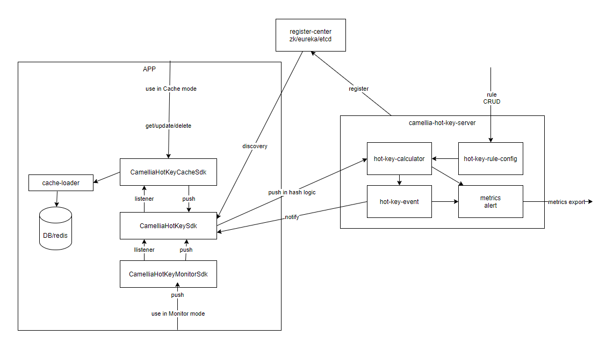

# camellia-hot-key

## 简介

* 一个热key探测和缓存的工具
* 包括SDK、Server两个模块
* 设计时参考了以下内外部开源的项目：[京东hotkey](https://gitee.com/jd-platform-opensource/hotkey) 、[搜狐hotCaffeine](https://github.com/sohutv/hotcaffeine) 、云音乐music_hot_caffeine

## 特性

* 支持`热key探测`
* 支持`热key本地缓存`，本地缓存如果有更新，hot-key-server会自动广播给所有sdk，从而保证数据的`弱`一致性（可能有百ms级的延迟）
* `namespace`维度划分服务，一个hot-key-server支持同时服务多个`namespace`
* 一个namespace下可以配置多条`rule`
* rule里配置key的匹配规则（字符串完全匹配、字符串前缀匹配、字符串包含、匹配所有、后缀匹配），以及热key的定义（时间窗口+阈值）
* 提供`CamelliaHotKeyMonitorSdk`（探测）和`CamelliaHotKeyCacheSdk`（探测+本地缓存）两种SDK，适配不同使用场景
* 支持自定义热key配置数据源（默认为本地文件配置），从而可以对接到你们的`配置中心`或者`管理后台`
* 支持topN统计（全局维度），依赖redis进行数据汇总，对redis仅有少量的调用
* 支持服务器自定义事件回调（热key回调+topN回调），从而可以对接到你们的`监控报警系统`或者`频控流控系统`
* 支持自定义的注册发现器（内置了zk和eureka两种实现，具体见：[hot-key-discovery](hot-key-discovery.md)
* 支持丰富的监控，用于监控服务运行状态，具体见：[console](console.md)

## 基本架构

  

## SDK部分

包括两个SDK：  
* CamelliaHotKeyMonitorSdk（仅用于监控热key）
* CamelliaHotKeyCacheSdk（用于监控热key，并且提供本地缓存功能）

具体见：[hot-key-sdk](hot-key-sdk.md)

## Server部分

* 服务器基于namespace来管理热key相关配置
* 每个namespace下可以配置多个rule
* rule主要用于设置key的匹配模式、热key的定义（多少时间内多少次请求），热key缓存过期时间（只有cache模式下需要）

具体见：[hot-key-server](hot-key-server.md)

## 性能测试

具体见：[performance](performance.md)