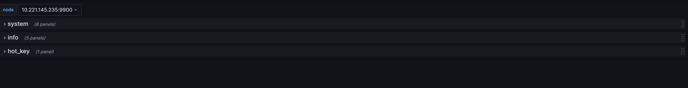
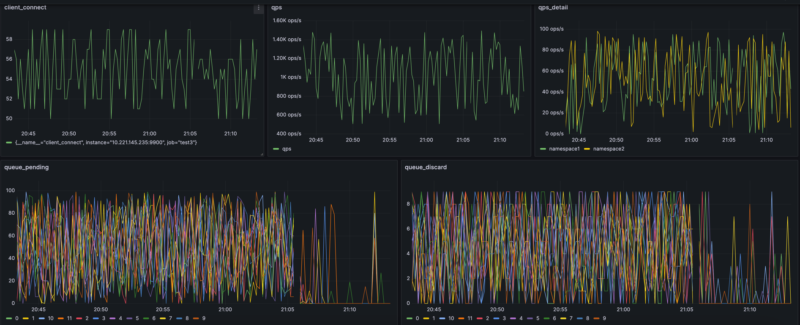
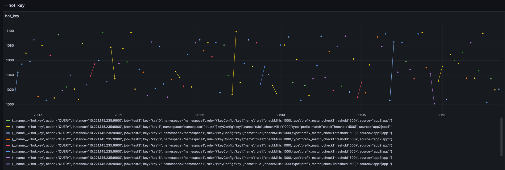

## use prometheus and grafana to monitor camellia-hot-key

### step1 install prometheus

### step2 config prometheus
prometheus.yml
```yaml
# my global config
global:
  scrape_interval: 60s # Set the scrape interval to every 15 seconds. Default is every 1 minute.
  evaluation_interval: 60s # Evaluate rules every 15 seconds. The default is every 1 minute.
  # scrape_timeout is set to the global default (10s).

# Alertmanager configuration
alerting:
  alertmanagers:
    - static_configs:
        - targets:
          # - alertmanager:9093

# Load rules once and periodically evaluate them according to the global 'evaluation_interval'.
rule_files:
  # - "first_rules.yml"
  # - "second_rules.yml"

# A scrape configuration containing exactly one endpoint to scrape:
# Here it's Prometheus itself.
scrape_configs:
  # The job name is added as a label `job=<job_name>` to any timeseries scraped from this config.
  - job_name: "prometheus"

    # metrics_path defaults to '/metrics'
    # scheme defaults to 'http'.

    static_configs:
      - targets: ["localhost:9090"]
  # The job name is added as a label `job=<job_name>` to any timeseries scraped from this config.
  - job_name: "hot_key_1"
    # metrics_path defaults to '/metrics'
    # scheme defaults to 'http'.
    metrics_path: "/metrics"
    static_configs:
      - targets: ["10.221.145.235:7070","10.221.145.234:7070"]%
```

config job_name, e.g. `hot_key_1`  
config targets, e.g. `["10.221.145.235:7070","10.221.145.234:7070"]`  

`10.221.145.235/10.221.145.234` is hot key server ip, `8080` is hot key server port  

### step3 install grafana
add datasource prometheus

### step4 import grafana-config.json to grafana

[grafana-conf.json](grafana-conf.json)

you should:  
* replace `job` name in json, e.g. `test2` to `hot_key_1`
* replace `prometheus.uid` in json, e.g. `ca547f68-c185-4008-9fe7-0ffa290eb12c`

### step5 dashboard

#### metrics
```
# HELP info Hot Key Server Info
# TYPE info gauge
info{camellia_version="1.2.22",arch="x86_64",os_name="Mac OS X",os_version="10.16",system_load_average="4.61572265625",vm_vendor="Oracle Corporation",vm_name="Java HotSpot(TM) 64-Bit Server VM",vm_version="25.311-b11",jvm_info="mixed mode",java_version="1.8.0_311",} 1
# HELP uptime Hot Key Server Uptime
# TYPE uptime gauge
uptime 266830678
# HELP start_time Hot Key Server StartTime
# TYPE start_time gauge
start_time 1703243003140
# HELP memory_info Hot Key Server Memory
# TYPE memory_info gauge
memory_info{type="free_memory"} 1799260610
memory_info{type="total_memory"} 5368709120
memory_info{type="max_memory"} 5368709120
memory_info{type="heap_memory_usage"} 2675428222
memory_info{type="no_heap_memory_usage"} 248407035
memory_info{type="netty_direct_memory"} 1192895303
# HELP cpu Hot Key Server Cpu
# TYPE cpu gauge
cpu{type="cpu_num"} 12
cpu{type="usage"} 246
# HELP gc Hot Key Server gc
# TYPE gc gauge
gc{name="PS Scavenge", type="count"} 3
gc{name="PS Scavenge", type="time"} 41
gc{name="PS MarkSweep", type="count"} 2
gc{name="PS MarkSweep", type="time"} 77
# HELP thread Hot Key Server Thread
# TYPE thread gauge
thread 12
# HELP client_connect Hot Key Server Client Connect
# TYPE client_connect gauge
client_connect 52
# HELP queue Hot Key Server Queue
# TYPE queue gauge
queue{name="0", type="pending"} 0
queue{name="0", type="discard"} 0
queue{name="1", type="pending"} 0
queue{name="1", type="discard"} 0
queue{name="2", type="pending"} 0
queue{name="2", type="discard"} 0
queue{name="3", type="pending"} 0
queue{name="3", type="discard"} 0
queue{name="4", type="pending"} 0
queue{name="4", type="discard"} 0
queue{name="5", type="pending"} 0
queue{name="5", type="discard"} 0
queue{name="6", type="pending"} 0
queue{name="6", type="discard"} 0
queue{name="7", type="pending"} 0
queue{name="7", type="discard"} 6
queue{name="8", type="pending"} 0
queue{name="8", type="discard"} 0
queue{name="9", type="pending"} 0
queue{name="9", type="discard"} 0
queue{name="10", type="pending"} 0
queue{name="10", type="discard"} 0
queue{name="11", type="pending"} 0
queue{name="11", type="discard"} 0
# HELP qps Hot Key Server QPS
# TYPE qps gauge
qps 504
# HELP qps_detail Hot Key Server QPS Detail
# TYPE qps_detail gauge
qps_detail{namespace="namespace1", type="QUERY"} 21
qps_detail{namespace="namespace2", type="QUERY"} 9
# HELP hot_key Hot Key Server Hot Key
# TYPE hot_key gauge
hot_key{namespace="namespace1", key="key19", action="QUERY", rule="{'keyConfig':'key1','name':'rule1','checkMillis':1000,'type':'prefix_match','checkThreshold':500}", source="app2|app1"} 1058
```

#### category  



####  system


#### info



#### hot_key




