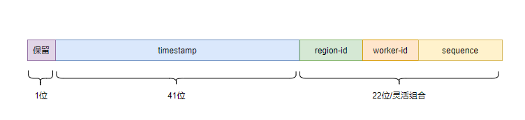

## 雪花算法
### 特性
* 单节点递增，全局趋势递增，保证全局唯一
* 支持设置region标记，从而可以在单元化部署中保证不同单元之间id不冲突
* 默认提供了一种基于redis的workerId生成策略，避免手动设置workerId的繁琐  
* regionId、workerId、sequence的比特位数支持自定义配置
* 提供一个spring-boot-starter，快速搭建一个基于雪花算法的发号器集群

### 原理
* 生成的id是一个64位的数字：首位保留，41位表示时间戳，剩余22位可以灵活配置regionId、workerId、sequence的比特位分配比例（22位可以不用完，以便减少id的长度）  
* 每个region的每个发号器节点的workerId都不同，确保id不重复  
* id前缀是时间戳，确保趋势递增
* 每个ms内使用递增sequence确保唯一    
* 核心源码参见CamelliaSnowflakeIdGen  

### id构成（二进制）


### 用法（直接使用）
引入maven依赖
```
<dependency>
    <groupId>com.netease.nim</groupId>
    <artifactId>camellia-id-gen-core</artifactId>
    <version>1.2.10</version>
</dependency>
```
示例如下：
```java
public class CamelliaSnowflakeIdGenTest {

    public static void main(String[] args) {
        CamelliaSnowflakeConfig config = new CamelliaSnowflakeConfig();
        config.setRegionBits(0);//单元id所占的比特位数，0表示不区分单元
        config.setRegionId(0);//regionId，如果regionBits为0，则regionId必须为0
        config.setWorkerIdBits(10);//workerId所占的比特位数
        config.setSequenceBits(12);//序列号所占比特位数
        //使用redis生成workerId
        config.setWorkerIdGen(new RedisWorkerIdGen(new CamelliaRedisTemplate("redis://@127.0.0.1:6379")));

        CamelliaSnowflakeIdGen idGen = new CamelliaSnowflakeIdGen(config);

        int i=2000;
        while (i -- > 0) {
            long id = idGen.genId();//生成id
            System.out.println(id);
            System.out.println(Long.toBinaryString(id));
            System.out.println(Long.toBinaryString(id).length());
            long ts = idGen.decodeTs(id);//从id中解析出时间戳
            System.out.println(ts);
            System.out.println(new Date(ts));
        }

        long target = 1000*10000;
        int j = 0;
        long start = System.currentTimeMillis();
        while (true) {
            idGen.genId();
            j++;
            if (j % 100000 == 0) {
                System.out.println("i=" + j);
            }
            if (j >= target) break;
        }
        long end = System.currentTimeMillis();
        System.out.println("QPS=" + (target / ((end - start)/1000.0)));
        //###idea里直接运行的简单测试结果：
        //QPS=4061738.424045491
    }
}

```

### 用法（使用spring-boot-starter)
引入maven依赖
```
<dependencies>
    <dependency>
        <groupId>com.netease.nim</groupId>
        <artifactId>camellia-id-gen-snowflake-spring-boot-starter</artifactId>
        <version>1.2.10</version>
    </dependency>
    <dependency>
        <groupId>com.netease.nim</groupId>
        <artifactId>camellia-redis-spring-boot-starter</artifactId>
        <version>1.2.10</version>
    </dependency>
</dependencies>
```
编写启动类：
```java
@SpringBootApplication
@ComponentScan(basePackages = {"com.netease.nim.camellia.id.gen.springboot.snowflake"})
public class Application {
    public static void main(String[] args) {
        SpringApplication.run(Application.class);
    }
}
```
配置application.yml
```yaml
server:
  port: 8081
spring:
  application:
    name: camellia-id-gen-snowflake
camellia-id-gen-snowflake:
  sequence-bits: 12 #序列号所占比特位数
  worker-id-bits: 10 #workerId所占的比特位数
  region-bits: 0 #单元id所占的比特位数，0表示不区分单元
  region-id: 0 #regionId，如果regionBits为0，则regionId必须为0
  worker-id: -1 #-1表示使用redis生成workerId
  redis-worker-id-gen-conf:
    namespace: camellia #使用redis生成workerId时不同的命名空间下，workerId生成互不干扰
    lock-expire-millis: 3000 #使用redis生成workerId时获取分布式锁时的超时时间
    renew-interval-millis: 1000 #使用redis生成workerId时续约workerId的间隔
    exit-if-renew-fail: false #如果续约失败（可能redis超时了，或者gc导致workerId被其他进程抢走了，概率较低），是否进程退出，默认false


camellia-redis:
  type: local
  local:
    resource: redis://@127.0.0.1:6379
  redis-conf:
    jedis:
      timeout: 2000
      min-idle: 0
      max-idle: 32
      max-active: 32
      max-wait-millis: 2000
    jedis-cluster:
      max-wait-millis: 2000
      min-idle: 0
      max-idle: 8
      max-active: 16
      max-attempts: 5
      timeout: 2000
```
启动后访问：  
http://127.0.0.1:8081/camellia/id/gen/snowflake/genId  
返回示例：  
```json
{
  "code": 200,
  "data": 6393964107649080,
  "msg": "success"
}
```
此外还提供了一个解析时间戳的接口：  
http://127.0.0.1:8081/camellia/id/gen/snowflake/decodeTs?id=6393964107649080  
返回示例：  
```json
{
  "code": 200,
  "data": 1632727639837,
  "msg": "success"
}
```  

解析regionId：  
http://127.0.0.1:8081/camellia/id/gen/snowflake/decodeRegionId?id=11111  
返回示例：
```json
{
    "code": 200,
    "data": 10,
    "msg": "success"
}
```

解析workerId：  
http://127.0.0.1:8081/camellia/id/gen/snowflake/decodeWorkerId?id=11111  
返回示例：
```json
{
    "code": 200,
    "data": 1,
    "msg": "success"
}
```

解析sequence：  
http://127.0.0.1:8081/camellia/id/gen/snowflake/decodeSequence?id=11111  
返回示例：
```json
{
    "code": 200,
    "data": 23,
    "msg": "success"
}
```

当使用spring-boot-starter部署了独立的发号器服务后，为了方便使用http方法访问相关接口，我们提供了一个简易的封装    
先引入maven依赖：  
```
<dependency>
    <groupId>com.netease.nim</groupId>
    <artifactId>camellia-id-gen-sdk</artifactId>
    <version>a.b.c</version>
</dependency>
```
示例代码如下：  
```java
public class CamelliaSnowflakeIdGenSdkTest {
    public static void main(String[] args) {
        CamelliaIdGenSdkConfig config = new CamelliaIdGenSdkConfig();
        config.setUrl("http://127.0.0.1:8081");
        config.setMaxRetry(5);//重试次数
        CamelliaSnowflakeIdGenSdk idGenSdk = new CamelliaSnowflakeIdGenSdk(config);
        long id = idGenSdk.genId();//生成id
        System.out.println(id);
        long ts = idGenSdk.decodeTs(id);//从id中解析出时间戳
        System.out.println(ts);
        System.out.println(new Date(ts));

        long target = 10*10000;
        int i = 0;
        long start = System.currentTimeMillis();
        while (true) {
            idGenSdk.genId();
            i++;
            if (i % 1000 == 0) {
                System.out.println("i=" + i);
            }
            if (i >= target) break;
        }
        long end = System.currentTimeMillis();
        System.out.println("QPS=" + (target / ((end - start)/1000.0)));
        //###idea里直接运行的简单测试结果：
        //QPS=5052.801778586226
    }
}


```

### 使用安装包启动发号器服务
具体见：[quick-start-package](quick-start-package-snowflake.md)  

### 示例源码
[源码](/camellia-samples/camellia-id-gen-snowflake-samples)