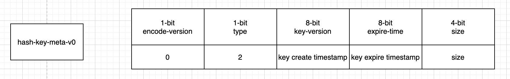
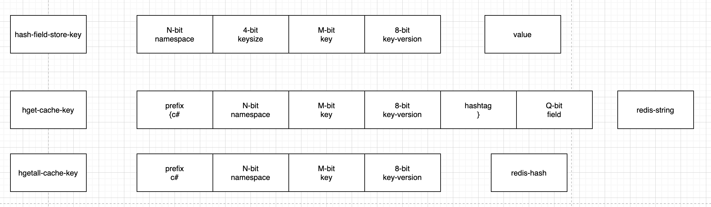
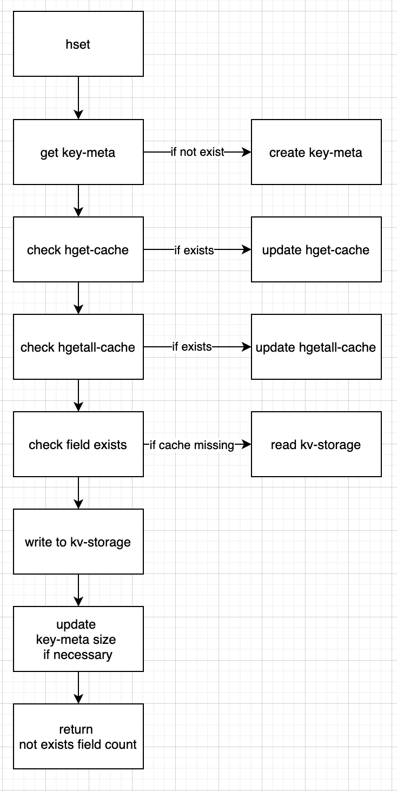
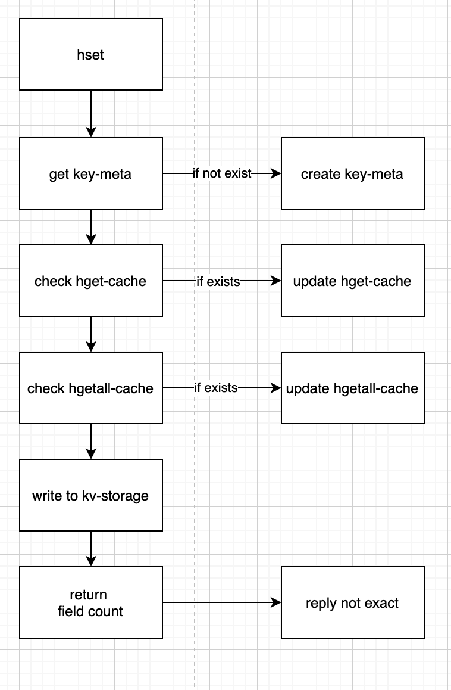
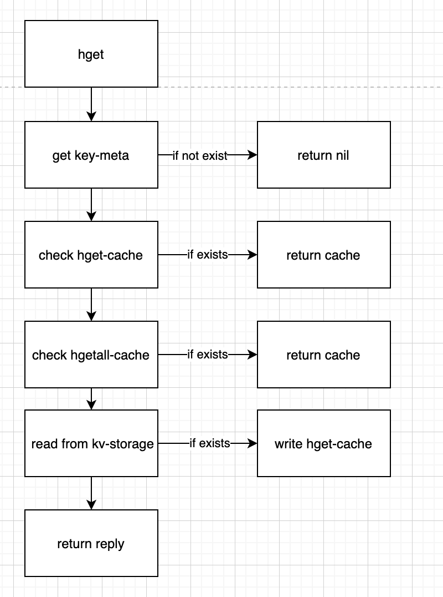
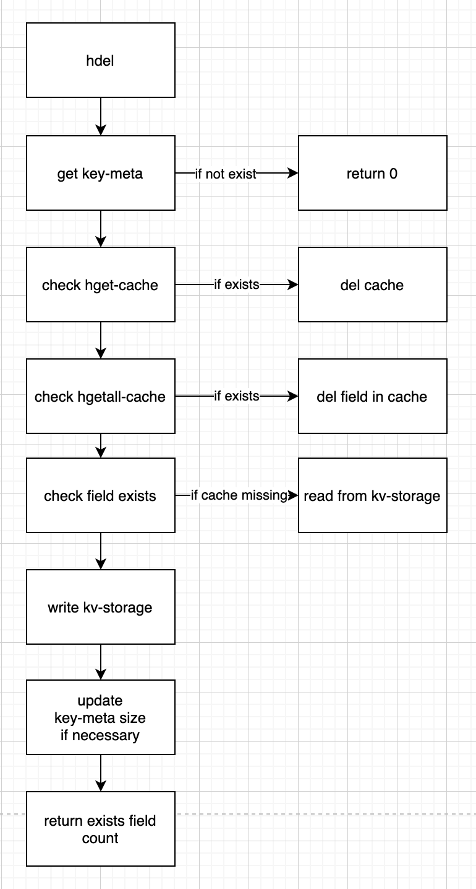
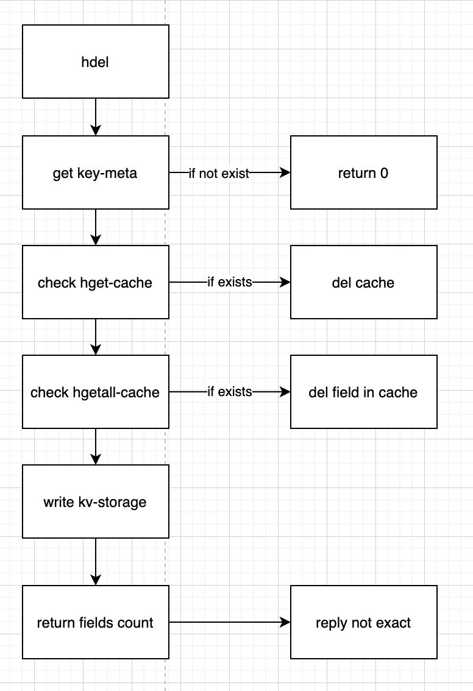
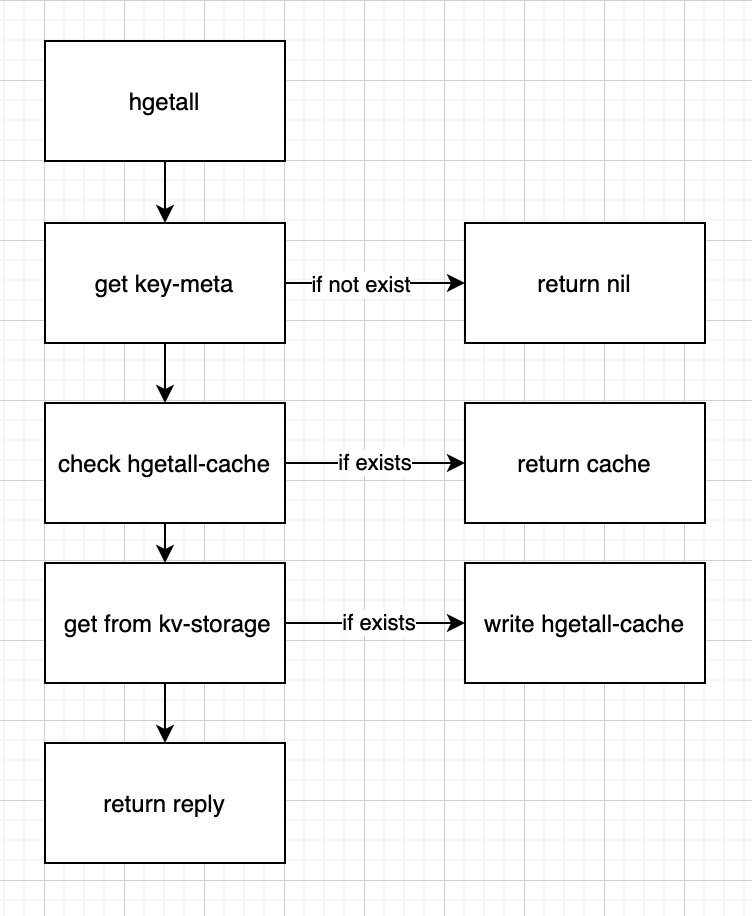
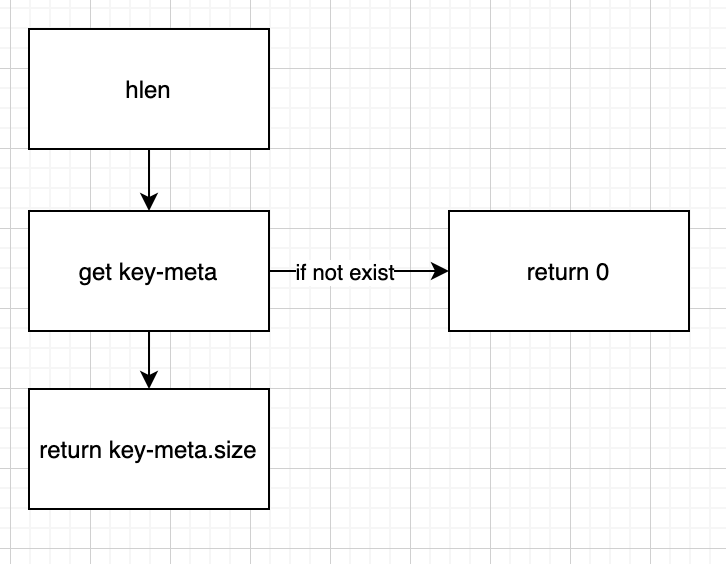
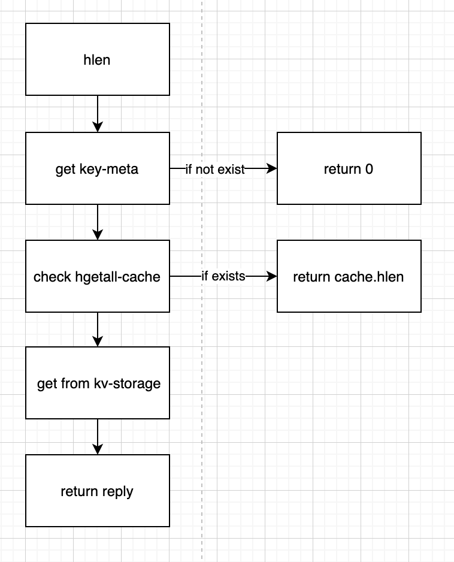

## camellia-redis-proxy-kv

基于camellia-redis-proxy的可插拔架构设计，支持对接外部kv存储，模拟redis协议

## 基本架构

* proxy基于redis-cluster模式运行，因此相同key会路由到同一个proxy节点（proxy节点扩缩容时需要精细化处理，todo）
* proxy内部多work-thread运行，每个命令根据key哈希到同一个work-thread运行
* proxy本身弱状态
* proxy依赖的存储包括三种类型：key-meta-server、cache-server、kv-storage
* key-meta-server，用于维护key的meta信息，包括key的类型、版本、ttl等，可以基于redis实现，也可以基于hbase/tikv/oceanbase实现
* cache-server，可选组件，基于redis，特点是key的ttl很短，并且允许换出
* kv-storage，持久化层，抽象简单的put/get/delete/scan等接口，可以基于hbase/tikv/oceanbase实现

## key-meta结构

## string数据结构

todo

## hash数据结构

hash数据有两种编码模式，区别在于key-meta中是否记录size字段，也就是哈希中元素个数

### hset命令

#### version-0

#### version-1

### hget命令

#### version-0 and version-1

### hdel命令

#### version-0

#### version-1

### hgetall命令

#### version-0 and version-1

### hlen命令

#### version-0

#### version-1

## zset数据结构

todo

## list数据结构

todo

## set数据结构

todo