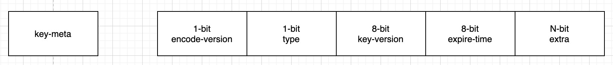

## camellia-redis-proxy-kv

基于camellia-redis-proxy的可插拔架构设计，支持对接外部kv存储，模拟redis协议

## 基本架构



* proxy基于redis-cluster模式运行，因此相同key会路由到同一个proxy节点（proxy节点扩缩容时需要精细化处理，todo）
* proxy内部多work-thread运行，每个命令根据key哈希到同一个work-thread运行
* proxy本身弱状态
* proxy依赖的服务逻辑上包括三组：key-meta-server、subkey-server、redis-cache-server
* key-meta-server，用于维护key的meta信息，包括key的类型、版本、ttl等，可以基于hbase/tikv/obkv实现
* subkey-server，用于存储hash中的field等subkey，可以基于hbase/tikv/obkv实现
* redis-cache-server，可选，基于redis，特点是key的ttl很短，并且允许换出
* kv-storage层，抽象了简单的put/get/delete/scan接口，从而可以自由的选择hbase/tikv/obkv去实现key-meta-server和subkey-server，也可以基于其他kv存储
* 参考了 [pika](https://github.com/OpenAtomFoundation/pika) 、 [kvrocks](https://github.com/apache/kvrocks) 、 [tidis](https://github.com/yongman/tidis)、 [titan](https://github.com/distributedio/titan)、 [titea](https://github.com/distributedio/titan) 的设计
* 使用gc机制来回收kv存储层的过期数据（todo）

## key-meta结构

|           key            |                           value                           |
|:------------------------:|:---------------------------------------------------------:|
|   m# + namespace + key   |           1-bit + 1-bit + 8-bit + 8-bit + N-bit           |
| prefix + namespace + key | encode-version + type + key-version + expire-time + extra |

```java
public enum KeyType {
    string((byte) 1),
    hash((byte) 2),
    zset((byte) 3),
    list((byte) 4),
    set((byte) 5),
}
```

key-meta本身支持配置redis-cache-server，从而加快读写（可换出）

```properties
#key-meta是否开启缓存，默认false
kv.meta.cache.enable=false
#key-meta开启缓存时的ttl，默认10分钟
kv.key.meta.cache.millis=600000
```

## db commands

| command |                                            info |
|:-------:|------------------------------------------------:|
|   del   |                             `DEL key [key ...]` |
| exists  |                          `EXISTS key [key ...]` | 
| expire  |                            `EXPIRE key seconds` |
| pexpire |                      `PEXPIRE key milliseconds` |
| unlink  |                          `UNLINK key [key ...]` |

## string数据结构

|           key            |                   value                   |
|:------------------------:|:-----------------------------------------:|
|   m# + namespace + key   |   1-bit + 1-bit + 8-bit + 8-bit + N-bit   |
| prefix + namespace + key | 0 + 1 + key-version + expire-time + value |

* 只有一种编码结构
* 只有key-meta，没有sub-key
* 没有专门的缓存结构，依赖于key-meta本身的缓存

| command |                                                                                                                                  info |
|:-------:|--------------------------------------------------------------------------------------------------------------------------------------:|
|  setex  |                                                                                                             `SETEX key seconds value` |
| psetex  |                                                                                                       `PSETEX key milliseconds value` | 
|   set   |  `SET key value [NX \| XX] [GET] [EX seconds \| PX milliseconds \| EXAT unix-time-seconds \| PXAT unix-time-milliseconds \| KEEPTTL]` |
|   get   |                                                                                                                             `GET key` |
|  mget   |                                                                                                                  `MGET key [key ...]` |

## hash数据结构

hash数据有四种编码模式

```properties
##四种编码模式，0、1、2、3，默认0
kv.hash.key.meta.version=0
##在2和3这两种编码下，hget缓存的ttl，默认5分钟
kv.cache.hget.cache.millis=300000
##在2和3这两种编码下，hgetall缓存的ttl，默认5分钟
kv.cache.hgetall.cache.millis=30000
```

### version-0

#### key-meta

|           key            |                      value                      |
|:------------------------:|:-----------------------------------------------:|
|   m# + namespace + key   |      1-bit + 1-bit + 8-bit + 8-bit + 4-bit      |
| prefix + namespace + key | 0 + 2 + key-version + expire-time + field-count |

#### sub-key

|                         key                          |    value    |
|:----------------------------------------------------:|:-----------:|
| s# + namespace + key.len + key + key-version + field | field-value |

* 特点：encode-version固定为0
* 优点：hlen快，hset/hdel返回结果准确
* 缺点：写操作的读放大多

### version-1

#### key-meta

|           key            |               value               |
|:------------------------:|:---------------------------------:|
|   m# + namespace + key   |   1-bit + 1-bit + 8-bit + 8-bit   |
| prefix + namespace + key | 1 + 2 + key-version + expire-time |

#### sub-key

|                         key                          |    value    |
|:----------------------------------------------------:|:-----------:|
| s# + namespace + key.len + key + key-version + field | field-value |

* 特点：encode-version固定为1
* 优点：写入快
* 缺点：hlen慢，hset/hdel等操作返回结果不准确

### version-2和version-3

#### key-meta

* version-2同version-0，但是encode-version固定为2
* version-3同version-1，但是encode-version固定为3

#### sub-key

* version-2同version-0
* version-3同version-1

相比version-0和version-1，新增了redis缓存层

#### hget-cache-key

|                 redis-key                  |            redis-type             | redis-value |
|:------------------------------------------:|:---------------------------------:|------------:|
| c# + namespace + key + key-version + field |              string               | field-value |

#### hgetall-cache-key

|                 redis-key                 | redis-type |     redis-value |
|:-----------------------------------------:|:----------:|----------------:|
|    c# + namespace + key + key-version     |    hash    | full-hash-value |


### commands

| command |                                     info |    
|:-------:|-----------------------------------------:|
|  hset   | `HSET key field value [field value ...]` |
|  hmset  | `HSET key field value [field value ...]` |
|  hget   |                         `HGET key field` |
|  hmget  |            `HMGET key field [field ...]` |
|  hdel   |             `HDEL key field [field ...]` |
| hgetall |                            `HGETALL key` |
|  hlen   |                               `HLEN key` |


## zset数据结构

todo

## list数据结构

todo

## set数据结构

todo
