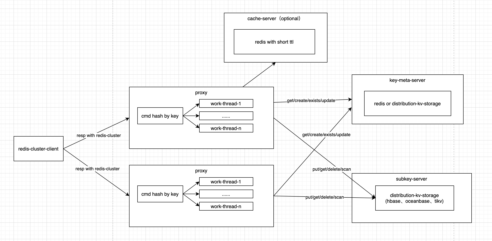

## camellia-redis-proxy-kv

基于camellia-redis-proxy的可插拔架构设计，支持对接外部kv存储，模拟redis协议

## 基本架构



* proxy基于redis-cluster模式运行，因此相同key会路由到同一个proxy节点（proxy节点扩缩容时需要精细化处理，todo）
* proxy内部多work-thread运行，每个命令根据key哈希到同一个work-thread运行
* proxy本身弱状态
* proxy依赖的存储包括三种类型：key-meta-server、cache-server、kv-storage
* key-meta-server，用于维护key的meta信息，包括key的类型、版本、ttl等，可以基于redis实现，也可以基于hbase/tikv/obkv实现
* cache-server，可选组件，基于redis，特点是key的ttl很短，并且允许换出
* kv-storage，持久化层，抽象简单的put/get/delete/scan等接口，可以基于hbase/tikv/obkv实现

## key-meta结构

|           key            |                           value                           |
|:------------------------:|:---------------------------------------------------------:|
|   m# + namespace + key   |           1-bit / 1-bit / 8-bit / 8-bit / N-bit           |
| prefix + namespace + key | encode-version / type / key-version / expire-time / extra |

```java
public enum KeyType {
    string((byte) 1),
    hash((byte) 2),
    zset((byte) 3),
}
```

## string数据结构

todo

## hash数据结构

hash数据有两种编码模式，区别在于key-meta中是否记录size字段，也就是哈希中元素个数

### key-meta

#### version-0

|           key            |                    value                     |
|:------------------------:|:--------------------------------------------:|
|   m# + namespace + key   |    1-bit / 1-bit / 8-bit / 8-bit / 4-bit     |
| prefix + namespace + key | 0 / 2 / key-version / expire-time / key-size |

* 优点：hlen快，hset/hdel返回结果准确
* 缺点：写操作的读放大多

#### version-1

|           key            |               value               |
|:------------------------:|:---------------------------------:|
|   m# + namespace + key   |   1-bit / 1-bit / 8-bit / 8-bit   |
| prefix + namespace + key | 0 / 2 / key-version / expire-time |

* 优点：写入快
* 缺点：hlen慢，hset/hdel等操作返回结果不准确


### commands

| command | version-0 | version-1 |
|:-------:|:---------:|:---------:|
|  hset   |           |           |
|  hget   |           |           |
|  hdel   |           |           |
| hgetall |           |           |
|  hlen   |           |           |


## zset数据结构

todo

## list数据结构

todo

## set数据结构

todo