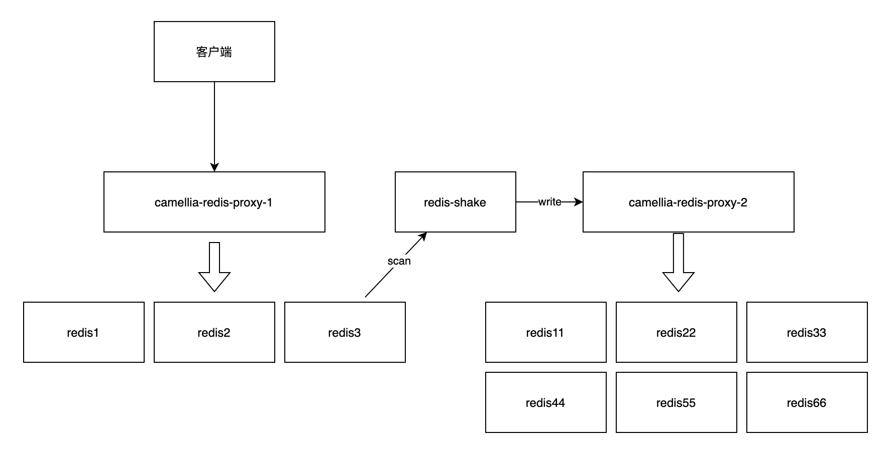

## 如何修改自定义分片的配置

* 业务场景：本来是一个3分片，现在要调整为6分片


### 方案一（双写）

使用场景：
* 所有key都有ttl
* 对数据一致性要求不那么高

#### 原始路由(三分片)
```json
{
  "1-2": "redis-sentinel://@127.0.0.1:26379/mymaster1",
  "3-4": "redis-sentinel://@127.0.0.1:26379/mymaster2",
  "5-6": "redis-sentinel://@127.0.0.1:26379/mymaster3"
}
```

#### 双写
```json
{
  "1": "redis-sentinel://@127.0.0.1:26379/mymaster1",
  "2": {
    "read": "redis-sentinel://@127.0.0.1:26379/mymaster1",
    "type": "rw_separate",
    "write": {
      "resources": [
        "redis-sentinel://@127.0.0.1:26379/mymaster1",
        "redis-sentinel://@127.0.0.1:26379/mymaster4"
      ],
      "type": "multi"
    }
  },
  "3": "redis-sentinel://@127.0.0.1:26379/mymaster2",
  "3-4": {
    "read": "redis-sentinel://@127.0.0.1:26379/mymaster2",
    "type": "rw_separate",
    "write": {
      "resources": [
        "redis-sentinel://@127.0.0.1:26379/mymaster2",
        "redis-sentinel://@127.0.0.1:26379/mymaster5"
      ],
      "type": "multi"
    }
  },
  "5": "redis-sentinel://@127.0.0.1:26379/mymaster3",
  "6": {
      "read": "redis-sentinel://@127.0.0.1:26379/mymaster3",
      "type": "rw_separate",
      "write": {
        "resources": [
          "redis-sentinel://@127.0.0.1:26379/mymaster3",
          "redis-sentinel://@127.0.0.1:26379/mymaster6"
        ],
        "type": "multi"
      }
    }
}
```

#### 切读（保持双写）
```json
{
  "1": "redis-sentinel://@127.0.0.1:26379/mymaster1",
  "2": {
    "read": "redis-sentinel://@127.0.0.1:26379/mymaster4",
    "type": "rw_separate",
    "write": {
      "resources": [
        "redis-sentinel://@127.0.0.1:26379/mymaster4",
        "redis-sentinel://@127.0.0.1:26379/mymaster1"
      ],
      "type": "multi"
    }
  },
  "3": "redis-sentinel://@127.0.0.1:26379/mymaster2",
  "4": {
    "read": "redis-sentinel://@127.0.0.1:26379/mymaster5",
    "type": "rw_separate",
    "write": {
      "resources": [
        "redis-sentinel://@127.0.0.1:26379/mymaster5",
        "redis-sentinel://@127.0.0.1:26379/mymaster2"
      ],
      "type": "multi"
    }
  },
  "5": "redis-sentinel://@127.0.0.1:26379/mymaster3",
  "6": {
      "read": "redis-sentinel://@127.0.0.1:26379/mymaster6",
      "type": "rw_separate",
      "write": {
        "resources": [
          "redis-sentinel://@127.0.0.1:26379/mymaster6",
          "redis-sentinel://@127.0.0.1:26379/mymaster3"
        ],
        "type": "multi"
      }
    }
}
```

#### 去掉双写
```json
{
  "1": "redis-sentinel://@127.0.0.1:26379/mymaster1",
  "2": "redis-sentinel://@127.0.0.1:26379/mymaster4",
  "3": "redis-sentinel://@127.0.0.1:26379/mymaster2",
  "4": "redis-sentinel://@127.0.0.1:26379/mymaster5",
  "5": "redis-sentinel://@127.0.0.1:26379/mymaster3",
  "6": "redis-sentinel://@127.0.0.1:26379/mymaster6"
}
```


### 方案二（redis-shake）



scan完成后，把proxy1的路由切成和proxy2的路由一样