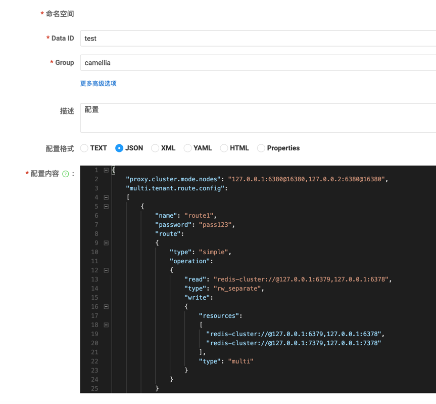

## 使用nacos管理并启动proxy的一个完整示例

### 0、示例背景
* 需要使用nacos管理proxy配置
* 使用proxy的双写功能
* 使用proxy的伪集群模式

### 1、安装java（jdk8+，至少1.8.0_202）
如已经安装则跳过

### 2、安装maven
参考：[maven](https://github.com/apache/maven)

### 3、安装nacos
参考：[nacos](https://github.com/alibaba/nacos)

### 4、编译camellia-redis-proxy-nacos-bootstrap并打包
```shell
git clone https://github.com/netease-im/camellia.git
cd camellia
mvn clean package
cp camellia-redis-proxy/camellia-redis-proxy-nacos-bootstrap/target/xxx.jar /yourdict/redis-proxy/xxx.jar
cd /yourdict/redis-proxy
jar xvf xxx.jar
rm -rf xxx.jar
touch start.sh
echo "java -XX:+UseG1GC -Xms4096m -Xmx4096m -server org.springframework.boot.loader.JarLauncher" > start.sh
chmod +x start.sh
cd ..
tar zcvf redis-proxy.tar.gz ./redis-proxy
```

### 5、配置nacos

* 把`redis-proxy.tar.gz`解压，修改`./BOOT-INF/classes`目录下的配置文件
* 修改`./BOOT-INF/classes/logback.xml`，可以参考logback-sample.xml去覆盖logback.xml，修改LOG_HOME即可（默认的logback.xml是标准输出）
* 修改`./BOOT-INF/classes/application.yml`，添加etcd配置

必填项：  
* nacos.serverAddr nacos服务器地址串
* nacos.dataId，表示配置的dataId，dataId+group标识一个配置文件
* nacos.group，表示配置的group，dataId+group标识一个配置文件
* nacos.config.type，配置类型，建议json（也支持properties）


```yml
server:
  port: 6380
spring:
  application:
    name: camellia-redis-proxy-server

camellia-redis-proxy:
  console-port: 16379
#  monitor-enable: false
#  monitor-interval-seconds: 60
  client-auth-provider-class-name: com.netease.nim.camellia.redis.proxy.auth.MultiTenantClientAuthProvider
  cluster-mode-enable: true #cluster-mode，把proxy伪装成cluster
  proxy-dynamic-conf-loader-class-name: com.netease.nim.camellia.redis.proxy.config.nacos.NacosProxyDynamicConfLoader
  config:
    "nacos.serverAddr": "127.0.0.1:8848"
    "nacos.dataId": "xxx"
    "nacos.group": "xxx"
    "nacos.config.type": "json" #也可以配置为json/properties
#  plugins: #引入哪些插件，内建的插件可以用别名，自定义插件用全类名
#    - monitorPlugin
#    - bigKeyPlugin
#    - hotKeyPlugin
  transpond:
    type: custom
    custom:
      proxy-route-conf-updater-class-name: com.netease.nim.camellia.redis.proxy.route.MultiTenantProxyRouteConfUpdater
```

### 6、在nacos中配置路由

json示例：
```json
{
    "proxy.cluster.mode.nodes": "127.0.0.1:6380@16380,127.0.0.2:6380@16380",
    "multi.tenant.route.config":
    [
        {
            "name": "route1",
            "password": "pass123",
            "route":
            {
                "type": "simple",
                "operation":
                {
                    "read": "redis-cluster://@127.0.0.1:6379,127.0.0.1:6378",
                    "type": "rw_separate",
                    "write":
                    {
                        "resources":
                        [
                          "redis-cluster://@127.0.0.1:6379,127.0.0.1:6378",
                          "redis-cluster://@127.0.0.1:7379,127.0.0.1:7378"
                        ],
                        "type": "multi"
                    }
                }
            }
        }
    ]
}
```

字段说明：
* proxy.cluster.mode.nodes表示proxy的节点列表（不需要写所有节点，节点会互相发现，但是列表中的节点必须是活着的，否则重启时会失败），格式是ip:port@cport
* multi.tenant.route.config表示路由配置，是一个数组，可以配置多个路由，通过不同的密码区分
* name表示路由名称，不得重复
* password表示密码，用于区分不同的路由，不得重复
* route表示路由规则，示例中表达了一个简单的双写规则

其他路由配置方式，可以参考：[complex](../auth/complex.md) 和 [redis-resource](../auth/redis-resources.md)

一个etcd的配置截图：       


### 7、启动proxy

调用`./start.sh`依次启动所有proxy节点即可  

如果是jdk17/jdk21，则需要修改start.sh
```shell
java -XX:+UseG1GC --add-opens java.base/java.lang=ALL-UNNAMED --add-opens java.base/java.io=ALL-UNNAMED --add-opens java.base/java.math=ALL-UNNAMED --add-opens java.base/java.net=ALL-UNNAMED --add-opens java.base/java.nio=ALL-UNNAMED --add-opens java.base/java.security=ALL-UNNAMED --add-opens java.base/java.text=ALL-UNNAMED --add-opens java.base/java.time=ALL-UNNAMED --add-opens java.base/java.util=ALL-UNNAMED --add-opens java.base/jdk.internal.access=ALL-UNNAMED --add-opens java.base/jdk.internal.misc=ALL-UNNAMED --add-opens java.base/sun.net.util=ALL-UNNAMED -Xms4096m -Xmx4096m -server org.springframework.boot.loader.JarLauncher
```

`-XX:+UseG1GC` 表示gc策略，建议使用G1，如果是jdk17/jdk21，也可以使用`-XX:+UseZGC`  
`-Xms4096m -Xmx4096m` 表示内存大小，建议配置成一样的

### 8、扩缩容
* 扩容：直接新增节点，proxy会自动发现，并加入集群
* 缩容：请调用`curl -I http://127.0.0.1:16379/offline` ，等待一段时间后，如果没有流量了，再次调用，会返回200，表示下线成功（如果返回500则继续等待，因此可以间隔5s反复调用offline接口直到返回200即可），然后可以直接kill掉进程