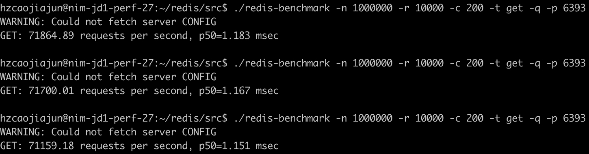

### feature

* 支持的**协议/后端**类型

|        proxy         |    版本     | redis-standalone | redis-sentinel | redis-cluster | memcache |
|:--------------------:|:---------:|:----------------:|:--------------:|:-------------:|:--------:|
| camellia-redis-proxy |  1.2.10   |        支持        |       支持       |      支持       |   不支持    |
|      twemproxy       |   0.5.0   |        支持        |       支持       |      不支持      |    支持    |
|       predixy        |   1.0.5   |        支持        |       支持       |      支持       |   不支持    |
|       overlord       |   1.9.4   |        支持        |      不支持       |      支持       |    支持    |
| redis-cluster-proxy  | 1.0-beta2 |       不支持        |      不支持       |      支持       |   不支持    |

* 支持的**命令**

|        proxy         |    版本     |                事务命令                | 发布订阅命令 | 阻塞型命令(如BLPOP) |              select命令              |                                 lua                                  | Streams redisJSON redisSearch | TAIR_HASH TAIR_ZSET TAIR_STRING | SCAN |
|:--------------------:|:---------:|:----------------------------------:|:------:|:-------------:|:----------------------------------:|:--------------------------------------------------------------------:|:-----------------------------------:|:-------------------------------------:|-----:|
| camellia-redis-proxy |  1.2.10   |                 支持                 |   支持   |      支持       | 仅支持redis-standalone/redis-sentinel |      支持eval/evalsha/eval_ro/evalsha_ro和script load/exists/flush      |                 支持                  |                  支持                   |   支持 | 
|      twemproxy       |   0.5.0   |                不支持                 |  不支持   |      不支持      |                不支持                 |                               仅支持eval                                |                 不支持                 |                  不支持                  |  不支持 |
|       predixy        |   1.0.5   | 仅支持redis-standalone/redis-sentinel |   支持   |      支持       | 仅支持redis-standalone/redis-sentinel | 支持eval/evalsha和script load，不支持eval_ro/evalsha_ro和script exists/flush |                 不支持                 |                  不支持                  |   支持 |
|       overlord       |   1.9.4   |                不支持                 |  不支持   |      不支持      |                不支持                 |                               仅支持eval                                |                 不支持                 |                  不支持                  |  不支持 |
| redis-cluster-proxy  | 1.0-beta2 |                 支持                 |   支持   |      支持       |                不支持                 |                           仅支持eval/evalsha                            |             仅支持Streams              |                  不支持                  |   支持 |

* 支持的**路由配置**

|        proxy         |    版本     | 自定义分片 | 读写分离 | 双写  | 双读  | 动态配置 | 多租户 | 
|:--------------------:|:---------:|:-----:|:----:|:---:|:---:|:----:|:---:|
| camellia-redis-proxy |  1.2.10   |  支持   |  支持  | 支持  | 支持  |  支持  | 支持  |
|      twemproxy       |   0.5.0   |  不支持  | 不支持  | 不支持 | 不支持 | 不支持  | 不支持 |
|       predixy        |   1.0.5   |  支持   |  支持  | 不支持 | 不支持 | 不支持  | 不支持 |
|       overlord       |   1.9.4   |  不支持  | 不支持  | 不支持 | 不支持 | 不支持  | 不支持 |
| redis-cluster-proxy  | 1.0-beta2 |  不支持  | 不支持  | 不支持 | 不支持 | 不支持  | 不支持 |

* 支持的**监控**功能

|        proxy         |    版本     | 响应时间 | 慢查询 | 大key | 热key | 热key缓存 | qps | 
|:--------------------:|:---------:|:----:|:---:|:----:|:----:|:------:|:---:|
| camellia-redis-proxy |  1.2.10   |  支持  | 支持  |  支持  |  支持  |   支持   | 支持  |
|      twemproxy       |   0.5.0   | 不支持  | 不支持 | 不支持  | 不支持  |  不支持   | 支持  |
|       predixy        |   1.0.5   |  支持  | 不支持 | 不支持  | 不支持  |  不支持   | 支持  |
|       overlord       |   1.9.4   | 不支持  | 支持  | 不支持  | 不支持  |  不支持   | 不支持 |
| redis-cluster-proxy  | 1.0-beta2 | 不支持  | 不支持 | 不支持  | 不支持  |  不支持   | 不支持 |

### performance-redis-standalone

* 4c8g云主机
* redis、proxy、redis-benchmark同机部署
* proxy+redis压测脚本：`redis-benchmark -n 1000000 -r 10000 -c 200 -t get -q -p 638x`
* 连续跑3次
* 各proxy配置见：[config1](config1.md)

|        proxy         |   版本   |                     结果                     |
|:--------------------:|:------:|:------------------------------------------:|
|       直连redis        | 7.0.11 |  |
| camellia-redis-proxy | 1.2.10 |  |
|      twemproxy       | 0.5.0  |  |
|       predixy        | 1.0.5  |  |
|       overlord       | 1.9.4  |  |

### performance-redis-cluster

* 4c8g云主机
* proxy、redis-benchmark同机部署
* redis-cluster部署在另外三台云主机上
* proxy压测脚本：`redis-benchmark -n 1000000 -r 10000 -c 200 -t get -q -p 639x`
* redis-cluster压测脚本：`redis-benchmark -n 1000000 -r 10000 -c 200 -t get -q -p 6601 -h 10.189.31.13 --cluster`
* 连续跑3次
* 各proxy配置见：[config1](config2.md)

|        proxy         |    版本     |                     结果                      |
|:--------------------:|:---------:|:-------------------------------------------:|
|   直连redis-cluster    |   4.0.9   |  |
| camellia-redis-proxy |  1.2.10   |  |
| redis-cluster-proxy  | 1.0-beta2 |  |
|       predixy        |   1.0.5   |  |
|       overlord       |   1.9.4   |  |

