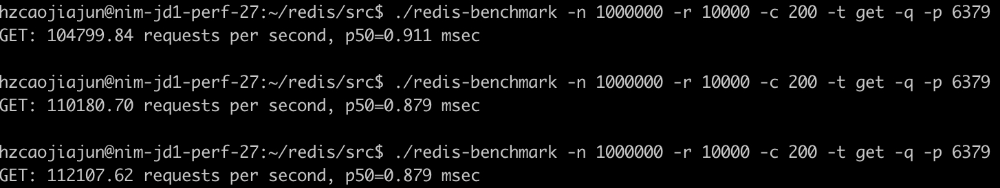
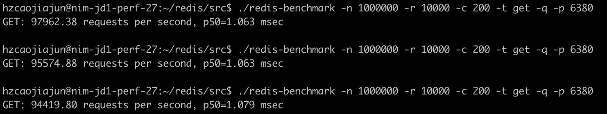
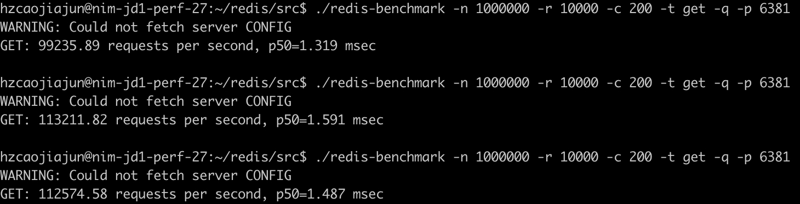
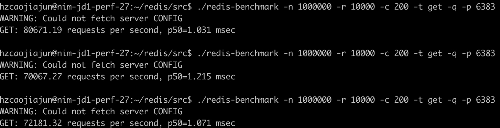

### feature

* 支持的**协议/后端**类型

|        proxy         |   版本   | redis-standalone | redis-sentinel | redis-cluster | memcache |
|:--------------------:|:------:|:----------------:|:--------------:|:-------------:|:--------:|
| camellia-redis-proxy | 1.2.10 |        支持        |       支持       |      支持       |   不支持    |
|      twemproxy       | 0.5.0  |        支持        |       支持       |      不支持      |    支持    |
|       predixy        | 1.0.5  |        支持        |       支持       |      支持       |   不支持    |
|       overlord       | 1.9.4  |        支持        |      不支持       |      支持       |    支持    |

* 支持的**命令**

|        proxy         |   版本   | 事务命令 | 发布订阅命令 | 阻塞型命令(如BLPOP) | select命令 | lua | Streams/redisJSON/redisSearch | TAIR_HASH/TAIR_ZSET/TAIR_STRING |
|:--------------------:|:------:|:----:|:------:|:-------------:|:--------:|:---:|:-----------------------------:|:-------------------------------:|
| camellia-redis-proxy | 1.2.10 |  支持  |   支持   |      支持       |    支持    | 支持  |              支持               |               支持                | 
|      twemproxy       | 0.5.0  | 不支持  |  不支持   |      不支持      |   不支持    | 支持  |              不支持              |               不支持               |
|       predixy        | 1.0.5  |  支持  |   支持   |      支持       |    支持    | 支持  |              不支持              |               不支持               |
|       overlord       | 1.9.4  | 不支持  |  不支持   |      不支持      |   不支持    | 不支持 |              不支持              |               不支持               |

* 支持的**路由配置**

|        proxy         |   版本   | 自定义分片 | 读写分离 | 双写  | 双读  | 动态配置 | 多租户 | 
|:--------------------:|:------:|:-----:|:----:|:---:|:---:|:----:|:---:|
| camellia-redis-proxy | 1.2.10 |  支持   |  支持  | 支持  | 支持  |  支持  | 支持  |
|      twemproxy       | 0.5.0  |  不支持  | 不支持  | 不支持 | 不支持 | 不支持  | 不支持 |
|       predixy        | 1.0.5  |  支持   |  支持  | 支持  | 支持  | 不支持  | 不支持 |
|       overlord       | 1.9.4  |  不支持  | 不支持  | 不支持 | 不支持 | 不支持  | 不支持 |

* 支持的**监控**功能

|        proxy         |   版本   | 响应时间 | 慢查询 | 大key | 热key | 热key缓存 | qps | 
|:--------------------:|:------:|:----:|:---:|:----:|:----:|:------:|:---:|
| camellia-redis-proxy | 1.2.10 |  支持  | 支持  |  支持  |  支持  |   支持   | 支持  |
|      twemproxy       | 0.5.0  | 不支持  | 不支持 | 不支持  | 不支持  |  不支持   | 支持  |
|       predixy        | 1.0.5  |  支持  | 不支持 | 不支持  | 不支持  |  不支持   | 支持  |
|       overlord       | 1.9.4  | 不支持  | 支持  | 不支持  | 不支持  |  不支持   | 不支持 |

### performance

* 4c8g云主机
* redis、proxy、redis-benchmark同机部署
* 压测脚本：`redis-benchmark -n 1000000 -r 10000 -c 200 -t get -q -p 63xx`
* 连续跑3次

|        proxy         |   版本   |                     结果                     |
|:--------------------:|:------:|:------------------------------------------:|
|       直连redis        |  7.0   |  |
| camellia-redis-proxy | 1.2.10 |  |
|      twemproxy       | 0.5.0  |  |
|       predixy        | 1.0.5  |  |
|       overlord       | 1.9.4  |  |

* camellia-redis-proxy配置：
```
./jdk-17.0.2/bin/java -XX:+UseG1GC --add-opens java.base/java.lang=ALL-UNNAMED -Xms2048m -Xmx2048m -server org.springframework.boot.loader.JarLauncher
```
```yml
server:
  port: 6380
spring:
  application:
    name: camellia-redis-proxy-server

camellia-redis-proxy:
  console-port: 16379
  monitor-enable: false
  monitor-interval-seconds: 60
  transpond:
    type: local
    local:
      type: simple
      resource: redis://@127.0.0.1:6379

```

* twemproxy配置
```yml
alpha:
  listen: 0.0.0.0:6381
  hash: fnv1a_64
  distribution: ketama
  auto_eject_hosts: true
  redis: true
  server_retry_timeout: 2000
  server_failure_limit: 1
  servers:
   - 127.0.0.1:6379:1
```
* predixy配置
```
## Specify a name for this predixy service
## redis command INFO can get this
Name PredixyExample

## Default is 0.0.0.0:7617
Bind 0.0.0.0:6382

## Worker threads
WorkerThreads 4

ClientTimeout 300

Include standalone.conf

```

```
StandaloneServerPool {
    Databases 1
    Hash crc16
    HashTag "{}"
    Distribution modula
    MasterReadPriority 60
    StaticSlaveReadPriority 50
    DynamicSlaveReadPriority 50
    RefreshMethod fixed
    ServerTimeout 1
    ServerFailureLimit 10
    ServerRetryTimeout 1
    KeepAlive 120
    Group shard001 {
       + 127.0.0.1:6379
    }
}
```
* overlord配置
```toml
[[clusters]]
# 每一个集群都应该拥有自己的姓名
name = "test-redis"

# overlord 现在仅仅支持默认的 fnv1a_64 的 hash 算法。写了其他的也没用。
hash_method = "fnv1a_64"

# overlord 在代理模式下仅仅支持 twemproxy 实现的 ketama hash 模式。
hash_distribution = "ketama"

# hash tag 应该是两个字符。如果key中出现这两个字符，那么 overlord 仅仅会使用这两个字符之间的子串来进行 hash 计算。也就是说，
# 当 hash tag 为 "{}" 的时候:  "test{123}name" 与 "{123}age" 将一定会出现在同一个缓存节点上。
hash_tag = ""

# 目前 overlord proxy 支持四种协议：
# 代理模式：memcache | memcache_binary | redis
# redis cluster模式：redis_cluster
cache_type = "redis"

# overlord支持你改变协议族，但是强烈不建议更改协议族，这里保持默认即可。
listen_proto = "tcp"

# 与协议族相对应的，这里是监听地址。
# 如果协议族是 unix ，则此地址应该为某个 sock 文件地址
# 如果(通常)协议族是 tcp，则此地址应该为 "0.0.0.0:端口号"
listen_addr = "0.0.0.0:6383"


# 暂不支持的选项，后期可能会考虑支持。
redis_auth = ""

# 建立连接超时,毫秒，一般应该大于客户端超时
dial_timeout = 1000
# 读超时,毫秒，一般应该大于客户端超时。
read_timeout = 1000

# 写超时，毫秒，一般应该大于客户端超时。
write_timeout = 1000

# 与每个缓存后端的连接数。
# 由于 overlord 是预先建立连接的，因此，连接数也就意味着 overlord 与后端保持的长连接的数量。
# 经过我们的一轮一轮压测，我们强烈建议将overlord到后端的连接设置为2。在这个时候，overlord可以发挥出极限性能。
# 但同时，因为有多个连接，那么来自同一个客户端的请求可能会被打乱顺序执行。
node_connections = 2

# 自动剔除节点次数。overlord-proxy 会每隔 300ms 对所有后端节点发送测试的 ping 指令。
# 一旦 ping 指令失败（任何失败都算），则计数累加1，直到达到次上限，则提出对应的后端节点。
ping_fail_limit = 3

# 是否启用自动剔除、加回节点。
ping_auto_eject = true

servers = [
    "127.0.0.1:6379:1 redis1",
]
```