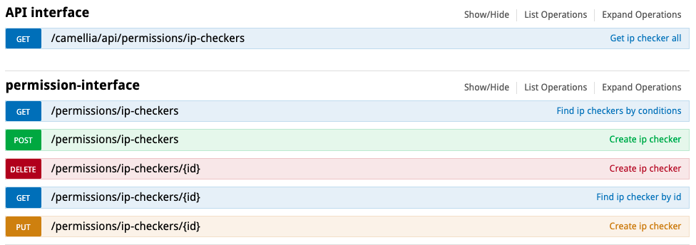

## DynamicIPCheckProxyPlugin

### Illustrate
* A plugin for ip black and white list restrictions on clients accessing proxy
* Supports blacklist mode, also supports whitelist mode, 
* Configuration supports dynamic change via `Camellia-dashboard`

### Enable method
````yaml
server:
  port: 6380
spring:
  application:
    name: camellia-redis-proxy-server

camellia-redis-proxy:
  console-port: 16379 #console port, the default is 16379, if set to -16379, there will be a random available port, if set to 0, the console will not be started
  password: pass123 #proxy password, if a custom client-auth-provider-class-name is set, the password parameter is invalid
  monitor-enable: true #Whether to enable monitoring
  monitor-interval-seconds: 60 #Monitor callback interval
  plugins: #Use yml to configure plugins, built-in plugins can be enabled directly using aliases, custom plugins need to configure the full class name
    - dynamicIpCheckerPlugin
  transpond:
    type: remote
    remote:
      url: http://127.0.0.1:8080 #camellia-dashboard's address
      check-interval-millis: 5000 # Polling period to camellia-dashboard
      dynamic: true # indicates that multiple sets of configurations are supported, the default is true
      header-map:
        api-key: secretToken
````

### Dynamic configuration (camellia-redis-proxy.properties)
- The interval of updating the plugin configuration
````properties
#The interval of updating the plugin configuration, the default is 5 seconds
proxy.plugin.update.interval.seconds=5
camellia.dashboard.url=http://127.0.0.1:8080
camellia.dashboard.headerMap={"api-key": "secretToken"}
````

### API management (Camellia-dashboard)
- The configuration of the plugin is stored in the database, and the configuration of the plugin can be modified through the API
- Check it out: [/permissions/ip-checkers APIs](http://localhost:8080/swagger-ui.html#!/permission-interface)
 
- APIs for managing plugin configurations:
  + [Find configurations](http://localhost:8080/swagger-ui.html#!/permission-interface/findIpCheckersUsingGET)
  + [Find a configuration by ID](http://localhost:8080/swagger-ui.html#!/permission-interface/findIpCheckerByIdUsingGET)
  + [Create a new configuration](http://localhost:8080/swagger-ui.html#!/permission-interface/CreateIpCheckerUsingPOST)
  + [Update a configuration](http://localhost:8080/swagger-ui.html#!/permission-interface/UpdateIpCheckerUsingPUT)
  + [Delete a configuration](http://localhost:8080/swagger-ui.html#!/permission-interface/DeleteIpCheckerUsingDELETE)
  + [Fetch all configurations](http://localhost:8080/swagger-ui.html#!/api%E6%8E%A5%E5%8F%A3/getIpCheckerListUsingGET)
- Sample response body:
```json
{
  "code": 200,
  "msg": "success",
  "data": {
    "id": 1,
    "bid": 0,
    "bgroup": "0",
    "mode": "WHITE",
    "ipList": [
      "2.2.2.2",
      "5.5.5.5",
      "3.3.3.0/24",
      "6.6.0.0/16"
    ],
    "updateTime": 1668161492780,
    "createTime": 1668161492780
  }
}
```
**NOTE:** **bid = -1 , bgroup = "default"** means that the configuration is global, and the configuration is applied for all. 
If you want to configure a specific bid and bgroup, you need to create a new configuration, and it will override the global configuration.