## use prometheus and grafana to monitor camellia-redis-proxy

### step1 install prometheus

### step2 config prometheus
prometheus.yml
```yaml
# my global config
global:
  scrape_interval: 60s # Set the scrape interval to every 15 seconds. Default is every 1 minute.
  evaluation_interval: 60s # Evaluate rules every 15 seconds. The default is every 1 minute.
  # scrape_timeout is set to the global default (10s).

# Alertmanager configuration
alerting:
  alertmanagers:
    - static_configs:
        - targets:
          # - alertmanager:9093

# Load rules once and periodically evaluate them according to the global 'evaluation_interval'.
rule_files:
  # - "first_rules.yml"
  # - "second_rules.yml"

# A scrape configuration containing exactly one endpoint to scrape:
# Here it's Prometheus itself.
scrape_configs:
  # The job name is added as a label `job=<job_name>` to any timeseries scraped from this config.
  - job_name: "prometheus"

    # metrics_path defaults to '/metrics'
    # scheme defaults to 'http'.

    static_configs:
      - targets: ["localhost:9090"]
  # The job name is added as a label `job=<job_name>` to any timeseries scraped from this config.
  - job_name: "redis_proxy_1"
    # metrics_path defaults to '/metrics'
    # scheme defaults to 'http'.
    metrics_path: "/metrics"
    static_configs:
      - targets: ["10.221.145.235:16379","10.221.145.234:16379"]%
```

config job_name, e.g. `redis_proxy_1`  
config targets, e.g. `["10.221.145.235:16379","10.221.145.234:16379"]`  

`10.221.145.235/10.221.145.234` is proxy ip, `16379` is proxy console port  

### step3 install grafana
add datasource prometheus

### step4 import grafana-config.json to grafana

you should:  
* replace `job` name in json, e.g. `test1` to `redis_proxy_1`
* replace `prometheus.uid` in json, e.g. `ca547f68-c185-4008-9fe7-0ffa290eb12c`

### step5 dashboard

#### category  

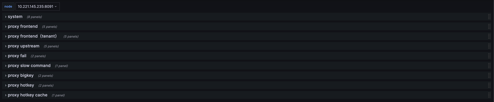

####  proxy nodes

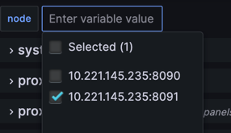

####  system 

* single node

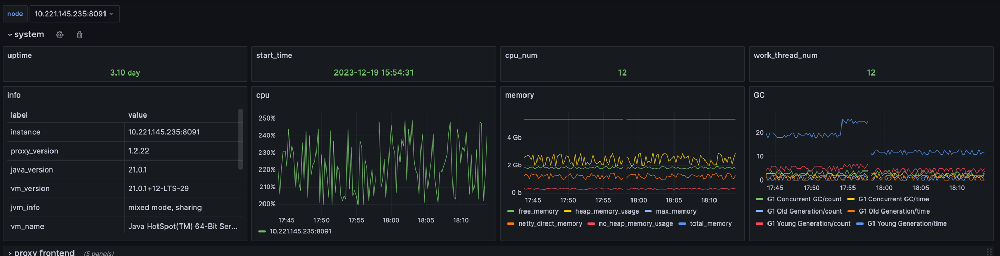

* multi nodes

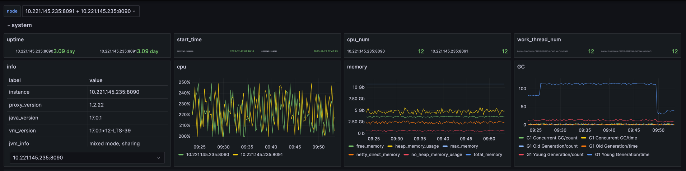

#### proxy frontend

* single node

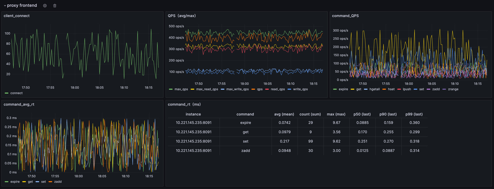

* multi node

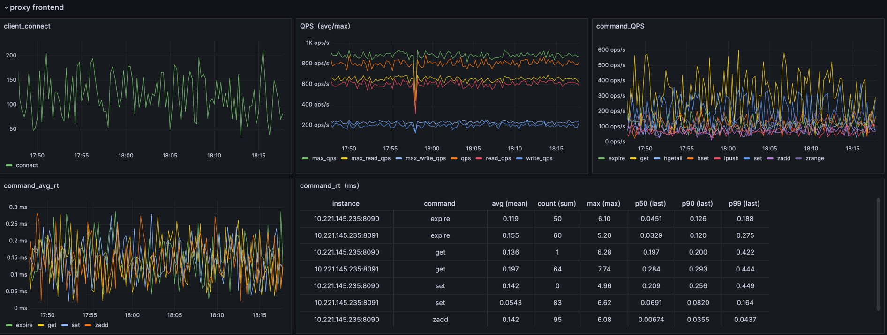

#### proxy frontend(tenant)

* single node

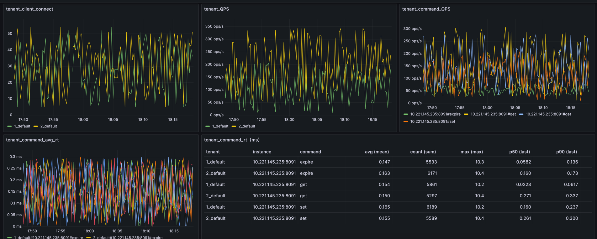

* multi node

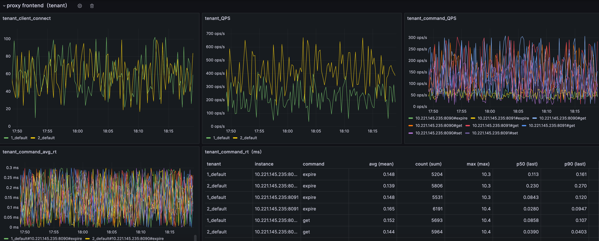

#### proxy upstream

* single node

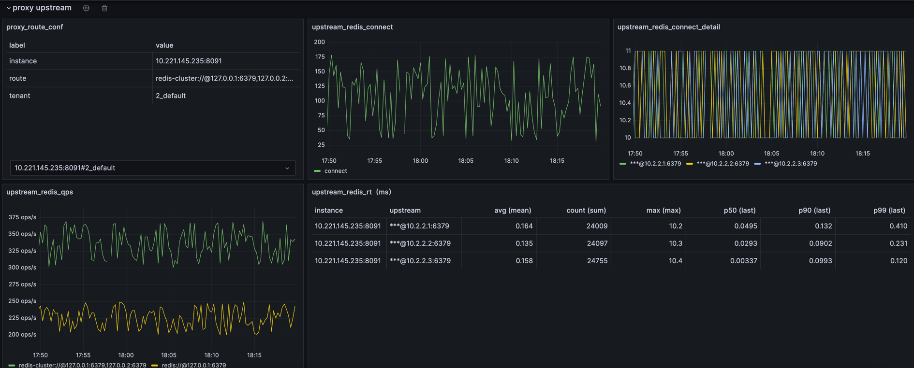

* multi node

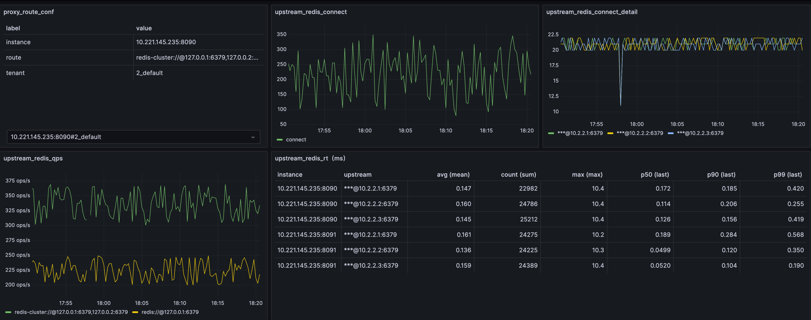

#### proxy fail

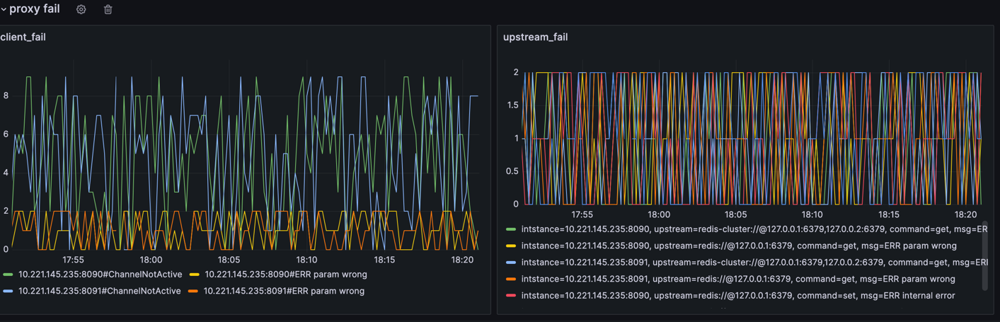

#### proxy slow command

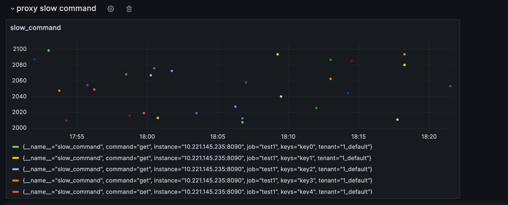

### proxy big key

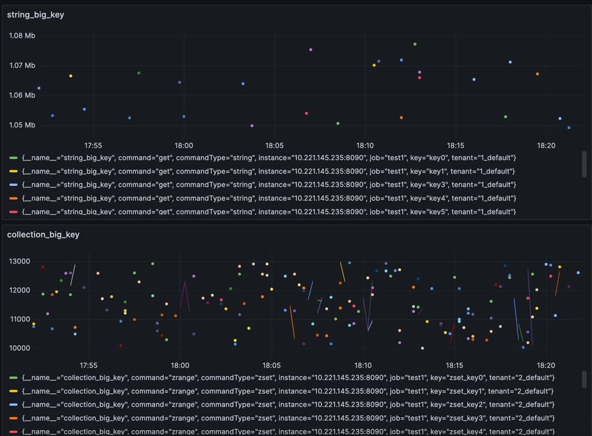

#### proxy hot key

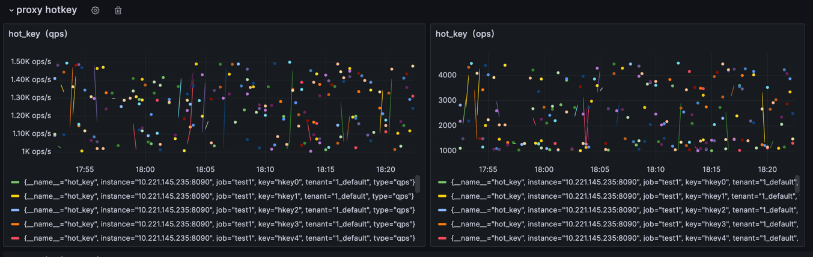

#### proxy hot key cache hit

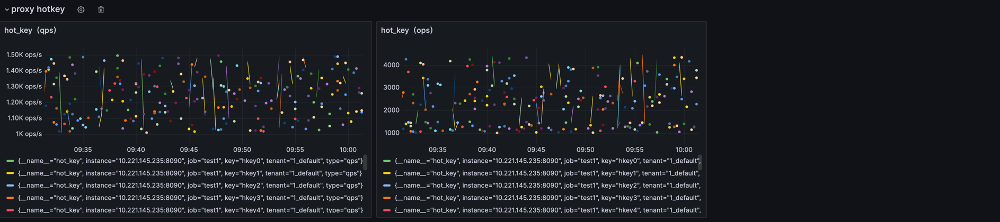