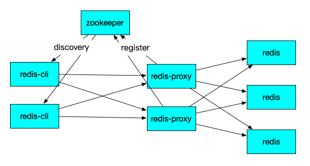

# camellia-redis-proxy([中文版](redis-proxy-zh.md))
## Instruction  
camellia-redis-proxy is a high performance proxy for redis, which base on netty4 and camellia-core.  

## Features
* support redis、redis sentinel、redis cluster
* support set password
* support blocking commands, such as BLPOP/BRPOP/BRPOPLPUSH/BZPOPMIN/BZPOPMAX and so on
* support pub-sub commands
* support transaction command, only when proxy route to redis/redis-sentinel with no-shading/no-read-write-separate
* support stream commands of redis5.0
* support custom shading
* support read write separation
* support double(multi) write
* support double(multi) read 
* support config refresh online(need camellia-dashboard)
* support multi-config(need camellia-dashboard), then proxy will route business-A to redis1, business-B to redis2 
* support custom CommandInterceptor, then you can intercept illegal command, such as too long key/value、lack of standardization of key
* support monitor, such as commands request count、commands spend time, support setting MonitorCallback
* support monitor slow command, support setting SlowCommandMonitorCallback
* support monitor hot key, support setting HotKeyMonitorCallback
* support hot key local cache(only support GET command), support setting HotKeyCacheStatsCallback
* support monitor big key, support setting BigKeyMonitorCallback
* provide a spring-boot-starter，you can quick start a proxy cluster
* provide a default register/discovery component depends on zookeeper, if client's language is java, then you can adjust slightly by use RedisProxyJedisPool instead of JedisPool  
* provide a spring-boot-starter, then you can use proxy in register/discovery mode when client is SpringRedisTemplate
* some conf support dynamic reload, see: [dynamic-conf](dynamic-conf.md)  

## Supported Commands
* Full Supported
```
##DataBase
PING,AUTH,ECHO,CLIENT,QUIT,EXISTS,DEL,TYPE,EXPIRE,
EXPIREAT,TTL,PERSIST,PEXPIRE,PEXPIREAT,PTTL,SORT,UNLINK,TOUCH,
##String
SET,GET,GETSET,MGET,SETNX,SETEX,MSET,DECRBY,DECR,INCRBY,INCR,APPEND,
STRLEN,INCRBYFLOAT,PSETEX,SETRANGE,GETRANGE,SUBSTR,
##Hash
HSET,HGET,HSETNX,HMSET,HMGET,HINCRBY,HEXISTS,HDEL,HLEN,HKEYS,
HVALS,HGETALL,HINCRBYFLOAT,HSCAN,
##List
RPUSH,LPUSH,LLEN,LRANGE,LTRIM,LINDEX,LSET,LREM,LPOP,RPOP,LINSERT,LPUSHX,RPUSHX,
##Set
SADD,SMEMBERS,SREM,SPOP,SCARD,SISMEMBER,SRANDMEMBER,SSCAN,
##ZSet
ZADD,ZINCRBY,ZRANK,ZCARD,ZSCORE,ZCOUNT,ZRANGE,ZRANGEBYSCORE,ZRANGEBYLEX,
ZREVRANK,ZREVRANGE,ZREVRANGEBYSCORE,ZREVRANGEBYLEX,ZREM,
ZREMRANGEBYRANK,ZREMRANGEBYSCORE,ZREMRANGEBYLEX,ZLEXCOUNT,ZSCAN,
ZPOPMAX,ZPOPMIN,
##BitMap
SETBIT,GETBIT,BITPOS,BITCOUNT,BITFIELD,
##Geo
GEOADD,GEODIST,GEOHASH,GEOPOS,GEORADIUS,GEORADIUSBYMEMBER,
##HyperLogLog
PFADD
##Stream
XACK,XADD,XCLAIM,XDEL,XLEN,XPENDING,XRANGE,XREVRANGE,XTRIM,XGROUP,XINFO,
```

* Restrictive Supported  
support only when all the keys in these command route to same redis-server or same redis-cluster slot  
```
##DataBase
RENAME,RENAMENX,
##String
MSETNX,
##Set
SINTER,SINTERSTORE,SUNION,SUNIONSTORE,SDIFF,SDIFFSTORE,SMOVE,
##List
BLPOP,BRPOP,RPOPLPUSH,BRPOPLPUSH,
##ZSet
ZUNIONSTORE,ZINTERSTORE,
BZPOPMAX,BZPOPMIN,
##HyperLogLog
PFCOUNT,PFMERGE,
##BitMap
BITOP,
##Script
EVAL,EVALSHA,
##Stream
XREADGROUP,XREAD,
```

* Partially Supported 1   
only support while have singleton-upstream(no custom shading) (standalone-redis or redis-sentinel or redis-cluster)
```
##PUBSUB
SUBSCRIBE,PUBLISH,UNSUBSCRIBE,PSUBSCRIBE,PUNSUBSCRIBE,PUBSUB,
```

* Partially Supported 2   
only support while have singleton-upstream(no custom shading) (standalone-redis or redis-sentinel)   
```
##DataBase
KEYS,SCAN,
MULTI,DISCARD,EXEC,WATCH,UNWATCH,
``` 

## Quick Start
1) you need a spring-boot project first, then add dependency in your pom.xml，like this（see [sample-code](/camellia-samples/camellia-redis-proxy-samples)）:   
```
<dependency>
  <groupId>com.netease.nim</groupId>
  <artifactId>camellia-redis-proxy-spring-boot-starter</artifactId>
  <version>a.b.c</version>
</dependency>
```
2) code Main Class Application.java, like this: 
```java
import com.netease.nim.camellia.redis.proxy.springboot.EnableCamelliaRedisProxyServer;
import org.springframework.boot.SpringApplication;
import org.springframework.boot.autoconfigure.SpringBootApplication;

@SpringBootApplication
@EnableCamelliaRedisProxyServer
public class Application {

    public static void main(String[] args) {
        SpringApplication.run(Application.class);
    }
}
```
3) add config in application.yml, like this:  
```yaml
server:
  port: 6380
spring:
  application:
    name: camellia-redis-proxy-server

camellia-redis-proxy:
  password: pass123
  transpond:
    type: local
    local:
      type: simple
      resource: redis-cluster://@127.0.0.1:6379,127.0.0.1:6378,127.0.0.1:6377
```
4) run Application.java, then a redis proxy to redis cluster is running.  
you can use redis-cli to connect proxy, port is 6380, password is pass123, if you don't want have a password, remove it in application.yml   
```
➜ ~ ./redis-cli -h 127.0.0.1 -p 6380 -a pass123
127.0.0.1:6380> set k1 v1
OK
127.0.0.1:6380> get k1
"v1"
127.0.0.1:6380> mget k1 k2 k3
1) "v1"
2) (nil)
3) (nil)
```

## Different Yaml Config Samples
### 1) route to standalone redis server  
* application.yml  
```yaml
server:
  port: 6380
spring:
  application:
    name: camellia-redis-proxy-server

camellia-redis-proxy:
  password: pass123
  transpond:
    type: local
    local:
      resource: redis://passwd@127.0.0.1:6379
```
### 2) route to redis sentinel  
* application.yml  
```yaml
server:
  port: 6380
spring:
  application:
    name: camellia-redis-proxy-server

camellia-redis-proxy:
  password: pass123
  transpond:
    type: local
    local:
      resource: redis-sentinel://passwd@127.0.0.1:6379,127.0.0.1:6377/master
```
### 3) route with read write separation(need two files)  
* application.yml  
```yaml
server:
  port: 6380
spring:
  application:
    name: camellia-redis-proxy-server

camellia-redis-proxy:
  password: pass123
  transpond:
    type: local
    local:
      type: complex
      json-file: resource-table.json
```
* resource-table.json  
```json
{
  "type": "simple",
  "operation": {
    "read": "redis://passwd123@127.0.0.1:6379",
    "type": "rw_separate",
    "write": "redis-sentinel://passwd2@127.0.0.1:6379,127.0.0.1:6378/master"
  }
}
```
it means write commands will route to redis-sentinel://passwd2@127.0.0.1:6379,127.0.0.1:6378/master, and read commands will route to redis://passwd123@127.0.0.1:6379
### 4) route with shading(need two files)  
* application.yml  
```yaml
server:
  port: 6380
spring:
  application:
    name: camellia-redis-proxy-server

camellia-redis-proxy:
  password: pass123
  transpond:
    type: local
    local:
      type: complex
      json-file: resource-table.json
```
* resource-table.json  
```json
{
  "type": "shading",
  "operation": {
    "operationMap": {
      "0-2-4": "redis://password1@127.0.0.1:6379",
      "1-3-5": "redis-cluster://@127.0.0.1:6379,127.0.0.1:6380,127.0.0.1:6381"
    },
    "bucketSize": 6
  }
}
```
it means keys will shading in 6 buckets, bucket.index=[0,2,4] route to redis://password1@127.0.0.1:6379, others route to redis-cluster://@127.0.0.1:6379,127.0.0.1:6380,127.0.0.1:6381 
### 5) route with double write(need two files)  
* application.yml  
```yaml
server:
  port: 6380
spring:
  application:
    name: camellia-redis-proxy-server

camellia-redis-proxy:
  password: pass123
  transpond:
    type: local
    local:
      type: complex
      json-file: resource-table.json
```
* resource-table.json  
```json
{
  "type": "simple",
  "operation": {
    "read": "redis://passwd1@127.0.0.1:6379",
    "type": "rw_separate",
    "write": {
      "resources": [
        "redis://passwd1@127.0.0.1:6379",
        "redis://passwd2@127.0.0.1:6380"
      ],
      "type": "multi"
    }
  }
}
```
it means:  
all the write-commands(like setex/zadd/hset and so on) will route to both redis://passwd1@127.0.0.1:6379 and redis://passwd2@127.0.0.1:6380, specially redis-cli wll get the command reply from first config write resource=redis://passwd1@127.0.0.1:6379;   
all the read-commands(like get/zrange/mget and so on) will route to redis://passwd1@127.0.0.1:6379.
### 6）route with multi read(need two files)  
* application.yml  
```yaml
server:
  port: 6380
spring:
  application:
    name: camellia-redis-proxy-server

camellia-redis-proxy:
  password: pass123
  transpond:
    type: local
    local:
      type: complex
      json-file: resource-table.json
```
* resource-table.json  
```json
{
  "type": "simple",
  "operation": {
    "read": {
      "resources": [
        "redis://password1@127.0.0.1:6379",
        "redis://password2@127.0.0.1:6380"
      ],
      "type": "random"
    },
    "type": "rw_separate",
    "write": "redis://passwd1@127.0.0.1:6379"
  }
}
```
it means:  
all the write-commands(like setex/zadd/hset and so on) will route to redis://passwd1@127.0.0.1:6379   
all the read-commands(like get/zrange/mget and so on) will route to redis://passwd1@127.0.0.1:6379 or redis://password2@127.0.0.1:6380 in random
### 7) proxy with shading/read-write-separation/double-write/multi-read(need two files)  
* application.yml  
```yaml
server:
  port: 6380
spring:
  application:
    name: camellia-redis-proxy-server

camellia-redis-proxy:
  password: pass123
  transpond:
    type: local
    local:
      type: complex
      json-file: resource-table.json
```
* resource-table.json  
```json
{
  "type": "shading",
  "operation": {
    "operationMap": {
      "4": {
        "read": "redis://password1@127.0.0.1:6379",
        "type": "rw_separate",
        "write": {
          "resources": [
            "redis://password1@127.0.0.1:6379",
            "redis://password2@127.0.0.1:6380"
          ],
          "type": "multi"
        }
      },
      "5": {
        "read": {
          "resources": [
            "redis://password1@127.0.0.1:6379",
            "redis://password2@127.0.0.1:6380"
          ],
          "type": "random"
        },
        "type": "rw_separate",
        "write": {
          "resources": [
            "redis://password1@127.0.0.1:6379",
            "redis://password2@127.0.0.1:6380"
          ],
          "type": "multi"
        }
      },
      "0-2": "redis://password1@127.0.0.1:6379",
      "1-3": "redis://password2@127.0.0.1:6380"
    },
    "bucketSize": 6
  }
}
```
it means keys shading in 6 buckets, and bucket.index=4 is read-write-separation and double-write, bucket.index=5 is read-write-separation and double-write/multi-read 
### 7) config from camellia-dashboard  
* application.yml  
```yaml
server:
  port: 6380
spring:
  application:
    name: camellia-redis-proxy-server

camellia-redis-proxy:
  password: pass123
  transpond:
    type: remote
    remote:
      bid: 1
      bgroup: default
      url: http://127.0.0.1:8080
      check-interval-millis: 5000
```
it means config will get from camellia-dashboard, config named bid=1 and bgroup=default will be used.   
furthermore, config will reload if config changed in camellia-dashboard, redis proxy use http protocol to check config if change, default check interval is 5s.  

### 8) config from camellia-dashboard with multi-config  
* application.yml  
```yaml
server:
  port: 6380
spring:
  application:
    name: camellia-redis-proxy-server

camellia-redis-proxy:
  password: pass123
  transpond:
    type: remote
    remote:
      url: http://127.0.0.1:8080
      check-interval-millis: 5000
      dynamic: true
```
it means redis proxy support route business-A to redis1, business-B to redis2.   
this feature requires redis-cli declare business type, client can use client setname command to declare, client name with camellia_10_default means use config with bid=10 and bgroup=defualt from camellia-dashboard.
```
➜ ~ ./redis-cli -h 127.0.0.1 -p 6380 -a pass123
127.0.0.1:6379> client setname camellia_10_default
OK
127.0.0.1:6380> set k1 v1
OK
127.0.0.1:6380> get k1
"v1"
127.0.0.1:6380> mget k1 k2 k3
1) "v1"
2) (nil)
3) (nil)
```
take java/jedis as example, you need init JedisPool like this:  
```java
public class Test {
    public static void main(String[] args) {
        JedisPool jedisPool = new JedisPool(new JedisPoolConfig(), "127.0.0.1", 6380,
                2000, "pass123", 0, "camellia_10_default");
        Jedis jedis = null;
        try {
            jedis = jedisPool.getResource();
            jedis.setex("k1", 10, "v1");
        } finally {
            if (jedis != null) {
                jedis.close();
            }
        }
    }
}
```

## Custom CommandInterceptor
if you want to add a custom CommandInterceptor to intercept illegal commands, then you need implements CommandInterceptor, like this:
```java
package com.netease.nim.camellia.redis.proxy.samples;

import com.netease.nim.camellia.redis.proxy.command.Command;
import com.netease.nim.camellia.redis.proxy.command.async.CommandContext;
import com.netease.nim.camellia.redis.proxy.command.async.CommandInterceptResponse;
import com.netease.nim.camellia.redis.proxy.command.async.CommandInterceptor;
import com.netease.nim.camellia.redis.proxy.enums.RedisCommand;

import java.net.InetSocketAddress;
import java.net.SocketAddress;
import java.util.List;

public class CustomCommandInterceptor implements CommandInterceptor {

    private static final CommandInterceptResponse KEY_TOO_LONG = new CommandInterceptResponse(false, "key too long");
    private static final CommandInterceptResponse VALUE_TOO_LONG = new CommandInterceptResponse(false, "value too long");
    private static final CommandInterceptResponse FORBIDDEN = new CommandInterceptResponse(false, "forbidden");

    @Override
    public CommandInterceptResponse check(Command command) {
        CommandContext commandContext = command.getCommandContext();
        Long bid = commandContext.getBid();
        String bgroup = commandContext.getBgroup();
        if (bid != null && bid != 1 && bgroup != null && !bgroup.equals("default")) {
            return CommandInterceptResponse.SUCCESS;
        }
        SocketAddress clientSocketAddress = commandContext.getClientSocketAddress();
        if (clientSocketAddress instanceof InetSocketAddress) {
            String hostAddress = ((InetSocketAddress) clientSocketAddress).getAddress().getHostAddress();
            if (hostAddress != null && hostAddress.equals("10.128.1.1")) {
                return FORBIDDEN;
            }
        }
        List<byte[]> keys = command.getKeys();
        if (keys != null && !keys.isEmpty()) {
            for (byte[] key : keys) {
                if (key.length > 256) {
                    return KEY_TOO_LONG;
                }
            }
        }
        if (command.getRedisCommand() == RedisCommand.SET) {
            byte[][] objects = command.getObjects();
            if (objects.length > 3) {
                byte[] value = objects[2];
                if (value.length > 1024 * 1024 * 5) {
                    return VALUE_TOO_LONG;
                }
            }
        }
        return CommandInterceptResponse.SUCCESS;
    }
}


```
then, you should config it in application.yml, like this: 
```
server:
  port: 6380
spring:
  application:
    name: camellia-redis-proxy-server

camellia-redis-proxy:
  password: pass123
  transpond:
    type: local
    local:
      resource: redis://@127.0.0.1:6379
  command-interceptor-class-name: com.netease.nim.camellia.redis.proxy.samples.CustomCommandInterceptor
```
it means  
client with ip=10.128.1.1 is forbidden  
the key's length should not greater than 256  
if the command is SET, then value.length should not greater than 5M.  

## Multi Write
proxy support setting multi write mode, there are three multi write mode to choose: 
### first_resource_only
it means, when first redis reply, then reply to client, it is the default mode.
### all_resources_no_check
it means, all multi-write redis reply, then reply first redis's reply, you can config like this:  
```yaml
server:
  port: 6380
spring:
  application:
    name: camellia-redis-proxy-server

camellia-redis-proxy:
  password: pass123
  transpond:
    type: local
    local:
      resource: redis://@127.0.0.1:6379
    redis-conf:
      multi-write-mode: all_resources_no_check
```
### all_resources_check_error
it means, all multi-write redis reply, and none of replies is error, then reply first redis's reply, else reply the first error reply
```yaml
server:
  port: 6380
spring:
  application:
    name: camellia-redis-proxy-server

camellia-redis-proxy:
  password: pass123
  transpond:
    type: local
    local:
      resource: redis://@127.0.0.1:6379
    redis-conf:
      multi-write-mode: all_resources_check_error
```  

## Custom Shading
you can define custom ShadingFunc, the func will calc the shading hash code of the key, then calc hashcode % bucket.size to resolve location bucket of the key.  
the default ShadingFunc is com.netease.nim.camellia.core.client.env.DefaultShadingFunc.  
you can implements abstract class of com.netease.nim.camellia.core.client.env.AbstractSimpleShadingFunc, such like this:
```java
package com.netease.nim.camellia.redis.proxy.samples;

import com.netease.nim.camellia.core.client.env.AbstractSimpleShadingFunc;

public class CustomShadingFunc extends AbstractSimpleShadingFunc {
    
    @Override
    public int shadingCode(byte[] key) {
        if (key == null) return 0;
        if (key.length == 0) return 0;
        int h = 0;
        for (byte d : key) {
            h = 31 * h + d;
        }
        return (h < 0) ? -h : h;
    }
}
```  
then config it in application.yml, like this:  
```yaml
server:
  port: 6380
spring:
  application:
    name: camellia-redis-proxy-server

camellia-redis-proxy:
  password: pass123
  transpond:
    type: local
    local:
      type: complex
      json-file: resource-table.json
    redis-conf:
      shading-func: com.netease.nim.camellia.redis.proxy.samples.CustomShadingFunc
```


## Deployment Architecture
in production environment, we need more than one instance of redis proxy to ensure service high availability and horizontal expansion.                                                    
there are two ways to realize it.
* front 4-layer loadbalancer(such as lvs/ali-slb), like this:   
  

if use such architecture, then you can use redis proxy just like standalone redis server.

* register/discovery mode(such as zk/eureka/consul), like this:  

   
if use such architecture, you need implements loadbalancer policy in client side.
                                                                            
## Integrating Zookeeper
camellia provider a default implements of register/discovery mode depends on zookeeper.  
1) add maven dependency on redis proxy, like this: 
```
<dependency>
    <groupId>com.netease.nim</groupId>
    <artifactId>camellia-redis-proxy-zk-registry-spring-boot-starter</artifactId>
    <version>a.b.c</version>
</dependency>
``` 
2) add config in application.yml, like this:
```yaml
server:
  port: 6380
spring:
  application:
    name: camellia-redis-proxy-server

camellia-redis-proxy:
  password: pass123
  transpond:
    type: local
    local:
      resource: redis://@127.0.0.1:6379

camellia-redis-zk-registry:
  enable: true
  zk-url: 127.0.0.1:2181,127.0.0.2:2181
  base-path: /camellia
```
it means redis proxy will register to zk(127.0.0.1:2181,127.0.0.2:2181)    
if you want to register/deregister, you can use console server  
3) client  
you should get proxy address list from zk, and use client-loadbalancer policy to invoke proxy.  
if client language is java, camellia provider RedisProxyJedisPool to connect redis proxy easily.  
first, add maven dependency in your project, like this:  
```
<dependency>
    <groupId>com.netease.nim</groupId>
    <artifactId>camellia-redis-zk-discovery</artifactId>
    <version>a.b.c</version>
</dependency>
``` 
then you can use RedisProxyJedisPool instead of JedisPool.  
RedisProxyJedisPool use IProxySelector to define load balance policy, default use RandomProxySelector.  
if you set sideCarFirst=true, then RedisProxyJedisPool will use SideCarFirstProxySelector, in this policy, RedisProxyJedisPool will use side-car-proxy first.  
further more, SideCarFirstProxySelector policy will use same-region-proxy priority if you implement RegionResolver, camellia provide a IpSegmentRegionResolver implement which define region by ip-segment.  
certainly, you can implement custom IProxySelector to define your load balance policy.    
otherwise, if redis-proxy use camellia-dashboard and multi-config, then RedisProxyJedisPool should setting bid/bgroup.  
this is a sample:  
```java
import com.netease.nim.camellia.redis.proxy.RedisProxyJedisPool;
import com.netease.nim.camellia.redis.proxy.RegionResolver;
import com.netease.nim.camellia.redis.zk.discovery.ZkProxyDiscovery;
import redis.clients.jedis.Jedis;
import redis.clients.jedis.JedisPoolConfig;

public class TestRedisProxyJedisPool {

    public static void main(String[] args) {
        String zkUrl = "127.0.0.1:2181,127.0.0.2:2181";
        String basePath = "/camellia";
        String applicationName = "camellia-redis-proxy-server";
        ZkProxyDiscovery zkProxyDiscovery = new ZkProxyDiscovery(zkUrl, basePath, applicationName);

        RedisProxyJedisPool jedisPool = new RedisProxyJedisPool.Builder()
                .poolConfig(new JedisPoolConfig())
//                .bid(1)
//                .bgroup("default")
                .proxyDiscovery(zkProxyDiscovery)
                .password("pass123")
                .timeout(2000)
                .sideCarFirst(true)
                .regionResolver(new RegionResolver.IpSegmentRegionResolver("10.189.0.0/20:region1,10.189.208.0/21:region2", "default"))
//                .proxySelector(new CustomProxySelector())
                .build();

        Jedis jedis = null;
        try {
            jedis = jedisPool.getResource();
            jedis.setex("k1", 10, "v1");
        } finally {
            if (jedis != null) {
                jedis.close();
            }
        }
    }
}

```
if you use Spring RedisTemplate，and you want use proxy in discovery mode(zk), you should add maven dependency, like this:    
```
<dependency>
    <groupId>com.netease.nim</groupId>
    <artifactId>camellia-spring-redis-zk-discovery-spring-boot-starter</artifactId>
    <version>a.b.c</version>
</dependency>
```
and add config in application.yml, like this（similar, if redis-proxy use camellia-dashboard and multi-config, you should setting bid/bgroup）:    
```yaml
camellia-spring-redis-zk-discovery:
  application-name: camellia-redis-proxy-server
  #bid: 1
  #bgroup: default
  password: pass123
  zk-conf:
    zk-url: 127.0.0.1:2181
    base-path: /camellia
    side-car-first: true
    region-resolve-conf: 10.189.0.0/20:region1,10.189.208.0/21:region2
    default-region: default
  redis-conf:
    min-idle: 0
    max-active: 8
    max-idle: 8
    max-wait-millis: 2000
    timeout: 2000
```
then the default Spring RedisTemplate will call redis proxy in zk discovery mode(zk)    
sample code here：[sample code](/camellia-samples/camellia-spring-redis-samples)  

## Monitor
### local monitor
redis proxy provider monitor, you can use static method
``` 
public static Stats getStats();
```
in 
```
com.netease.nim.camellia.redis.proxy.monitor.RedisMonitor
```
to get the monitor metrics.  
otherwise, you can set MonitorCallback to get the monitor metrics   
you can open the monitor in application.yml, like this:  
```yaml
server:
  port: 6380
spring:
  application:
    name: camellia-redis-proxy-server

camellia-redis-proxy:
  monitor-enable: true
  command-spend-time-monitor-enable: true
  monitor-interval-seconds: 10
  password: pass123
  transpond:
    type: local
    local:
      resource: redis://@127.0.0.1:6379
```
above config means RedisMonitor will collect metrics, and will collect each command's spend time.  
every 10s, metrics bean com.netease.nim.camellia.redis.proxy.monitor.Stats will be refreshed.  
### remote monitor
if proxy use camellia-dashboard to manage config, then proxy will report metrics to dashboard every minute.   
then you can get the aggregate metrics in dashboard.  
remote monitor is default open when use camellia-dashboard in proxy, if you want close remote monitor, you can config like this:  
```yaml
server:
  port: 6380
spring:
  application:
    name: camellia-redis-proxy-server

camellia-redis-proxy:
  password: pass123
  transpond:
    type: remote
    remote:
      bid: 1
      bgroup: default
      dynamic: true
      url: http://127.0.0.1:8080
      monitor: false
```

## slow command monitor and callback
* depends on monitor-enable=true and command-spend-time-monitor-enable=true
* support setting slow command threshold of spend millis
* support setting callback, so you can dock to your monitoring system, default callback will print monitor info in log
* sample yml conf:    

```yaml
camellia-redis-proxy:
  monitor-enable: true
  monitor-interval-seconds: 60
  command-spend-time-monitor-enable: true
  slow-command-threshold-millis-time: 1000
  slow-command-callback-class-name: com.netease.nim.camellia.redis.proxy.command.async.spendtime.LoggingSlowCommandMonitorCallback
```

## hot key monitor and callback
* independent switch, default false
* support setting threshold of hot key, such as a key will consider as hot key if has N request in M millis
* support setting callback, so you can dock to your monitoring system, default callback will print monitor info in log
* sample yml conf:    

```yaml
camellia-redis-proxy:
  hot-key-monitor-enable: true
  hot-key-monitor-config:
    check-millis: 1000
    check-threshold: 10
    check-cache-max-capacity: 1000
    max-hot-key-count: 100
    hot-key-monitor-callback-class-name: com.netease.nim.camellia.redis.proxy.command.async.hotkey.LoggingHoyKeyMonitorCallback
```

## hot key cache and callback
* independent switch, default false
* support setting threshold of hot key, such as a key will consider as hot key if has N request in M millis
* support setting how long will the hot key will be cached
* support setting which key need to cache
* support setting max size of the hot key cache collection
* only support GET command
* support setting callback, so you can dock to your monitoring system, default callback will print monitor info in log
* sample yml conf:  

```yaml
camellia-redis-proxy:
  hot-key-cache-enable: true
  hot-key-cache-config:
    counter-check-millis: 1000 
    counter-check-threshold: 5
    counter-max-capacity: 1000
    need-cache-null: true
    cache-max-capacity: 1000 
    cache-expire-millis: 5000 
    hot-key-cache-stats-callback-interval-seconds: 20 
    hot-key-cache-stats-callback-class-name: com.netease.nim.camellia.redis.proxy.command.async.hotkeycache.LoggingHotKeyCacheStatsCallback 
    hot-key-cache-key-checker-class-name: com.netease.nim.camellia.redis.proxy.command.async.hotkeycache.DummyHotKeyCacheKeyChecker 
```

## big key monitor and callback
* independent switch, default false
* support setting threshold of big key in different data struct
* support setting callback, so you can dock to your monitoring system, default callback will print monitor info in log
* sample yml conf:

```yaml
camellia-redis-proxy:
  big-key-monitor-enable: true
  big-key-monitor-config:
    string-size-threshold: 10
    hash-size-threshold: 10
    zset-size-threshold: 10
    list-size-threshold: 10
    set-size-threshold: 10
    big-key-monitor-callback-class-name: com.netease.nim.camellia.redis.proxy.command.async.bigkey.LoggingBigKeyMonitorCallback
```

## Console Server
when redis proxy start, a console server will start at the same time, console server is a http server, default port is 16379, you can change console server port in application.yml, like this:  
```yaml
server:
  port: 6380
spring:
  application:
    name: camellia-redis-proxy-server

camellia-redis-proxy:
  console-port: 16380
  password: pass123
  transpond:
    type: local
    local:
      resource: redis://@127.0.0.1:6379
```    
if you want to use console service to monitor or online/offline, you can implements a ConsoleService which extends to ConsoleServiceAdaptor, like this:   
```java
@Component
public class MyConsoleService extends ConsoleServiceAdaptor implements InitializingBean {

    @Autowired
    private CamelliaRedisProxyBoot redisProxyBoot;

    @Autowired
    private CamelliaRedisProxyZkRegisterBoot zkRegisterBoot;

    @Override
    public ConsoleResult online() {
        zkRegisterBoot.register();
        return super.online();
    }

    @Override
    public ConsoleResult offline() {
        zkRegisterBoot.deregister();
        return super.offline();
    }

    @Override
    public void afterPropertiesSet() throws Exception {
        setServerPort(redisProxyBoot.getPort());
    }
}
```
the console server have six http api:    
* /online
will set a global var to ONLINE
* /offline
will set a global var to OFFLINE  
if proxy is idle, then return http.code=200,  
else, return http.code=500  
ps: only latest commands called 10s ago, the proxy will be considered idle.  
* /status
if status=ONLINE, return http.code=200,  
else return http.code=500  
* /check
if server.port is reachable, return http.code=200,  
else return http.code=500
* /monitor
get the metrics（tps、rt、slow command、hot key、big key、hot key cache），response is a json，the metrics' refresh interval seconds is same as RedisMonitor, [sample](monitor.json)
* /reload
reload dynamic conf  
* /custom
a custom api, you can override it, and use different params to distinguish different request type.  

in the sample code above, MyConsoleService autoWired CamelliaRedisProxyZkRegisterBoot,  
if we call /online, then CamelliaRedisProxyZkRegisterBoot will register to zk,  
if we call /offline, then CamelliaRedisProxyZkRegisterBoot will deregister to zk, and if proxy is not idle, will return http.code=500, so you can call /offline repeatedly until return 200.  
after /offline return http.code=200, then you can shutdown proxy gracefully.

## sample of application.yml
```yaml
server:
  port: 6380
spring:
  application:
    name: camellia-redis-proxy-server

camellia-redis-proxy:
  password: pass123
  monitor-enable: true
  monitor-interval-seconds: 60
  monitor-callback-class-name: com.netease.nim.camellia.redis.proxy.monitor.LoggingMonitorCallback
  command-spend-time-monitor-enable: true
  slow-command-threshold-millis-time: 1000
  slow-command-callback-class-name: com.netease.nim.camellia.redis.proxy.command.async.spendtime.LoggingSlowCommandMonitorCallback
  command-interceptor-class-name: com.netease.nim.camellia.redis.proxy.samples.CustomCommandInterceptor
  hot-key-monitor-enable: true
  hot-key-monitor-config:
    check-millis: 1000
    check-threshold: 10
    check-cache-max-capacity: 1000
    max-hot-key-count: 100
    hot-key-monitor-callback-class-name: com.netease.nim.camellia.redis.proxy.command.async.hotkey.LoggingHoyKeyMonitorCallback
  hot-key-cache-enable: true
  hot-key-cache-config:
    counter-check-millis: 1000
    counter-check-threshold: 5
    counter-max-capacity: 1000
    need-cache-null: true
    cache-max-capacity: 1000
    cache-expire-millis: 5000
    hot-key-cache-stats-callback-interval-seconds: 20
    hot-key-cache-stats-callback-class-name: com.netease.nim.camellia.redis.proxy.command.async.hotkeycache.LoggingHotKeyCacheStatsCallback
    hot-key-cache-key-checker-class-name: com.netease.nim.camellia.redis.proxy.command.async.hotkeycache.DummyHotKeyCacheKeyChecker
  big-key-monitor-enable: true
  big-key-monitor-config:
    string-size-threshold: 10
    hash-size-threshold: 10
    zset-size-threshold: 10
    list-size-threshold: 10
    set-size-threshold: 10
    big-key-monitor-callback-class-name: com.netease.nim.camellia.redis.proxy.command.async.bigkey.LoggingBigKeyMonitorCallback
  transpond:
    type: local
    local:
      resource: redis://@127.0.0.1:6379
    redis-conf:
      queue-type: disruptor
      multi-write-mode: first_resource_only
      shading-func: com.netease.nim.camellia.redis.proxy.samples.CustomShadingFunc

camellia-redis-zk-registry:
  enable: false
  zk-url: 127.0.0.1:2181
  base-path: /camellia
```  

## Performance
redis proxy have 3 work mode(since v1.0.9)
### NoneQueue
this is default work mode, commands will direct transpond to upstream redis server. 
### LinkedBlockingQueue
in this mode, commands will first deliver into local queue, commands will be merged if possible before transpond to upstream redis server.
```yaml
server:
  port: 6380
spring:
  application:
    name: camellia-redis-proxy-server

camellia-redis-proxy:
  password: pass123
  transpond:
    type: local
    local:
      resource: redis://@127.0.0.1:6379
    redis-conf:
      queue-type: linkedblockingqueue
```
### Disruptor
it is same to LinkedBlockingQueue, but use none-lock Disruptor instead of LinkedBlockingQueue. in this mode, redis proxy performance best, but cpu will use more.
```yaml
server:
  port: 6380
spring:
  application:
    name: camellia-redis-proxy-server

camellia-redis-proxy:
  password: pass123
  transpond:
    type: local
    local:
      resource: redis://@127.0.0.1:6379
    redis-conf:
      queue-type: disruptor
```

### performance report(comparison of 3 mode)
[use redis-benchmark（v1.0.8 vs v1.0.9）](performance-report-6.md)    
[use netease npt platform（v1.0.8 vs v1.0.9）](performance-report-7.md)

history performance report  
[route to redis cluster（v1.0.4）](performance-report-1.md)  
[shading（v1.0.4）](performance-report-2.md)  
[double write（v1.0.4）](performance-report-3.md)  
[negative tests（v1.0.4）](performance-report-4.md)  
[virtual machine（v1.0.7）](performance-report-5.md)  
